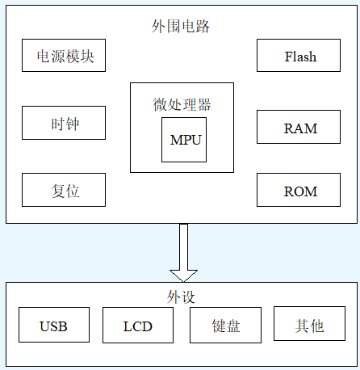
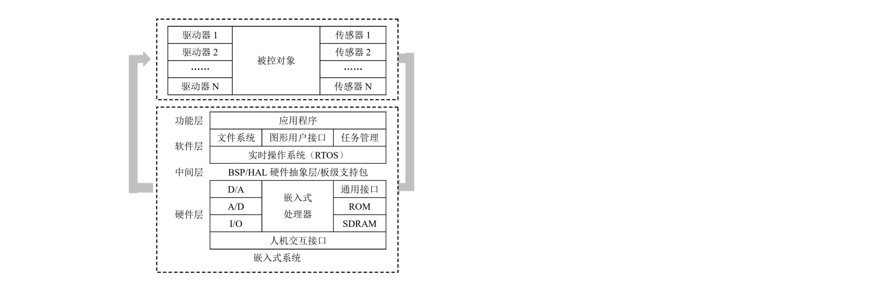

### 第1章 嵌入式系统概述
#### 复习概要

##### 1. 嵌入式系统的概念是什么? (T1, P11.1)
嵌入式系统 (embedded systems) 是指:
1. 嵌入到对象体系中的/用于执行独立功能的专用计算机系统.
2. 以应用为中心,以微电子技术/控制技术/计算机技术和通信技术为基础,强调硬件软件的协同性与整合性,软件硬件可剪裁的,适应应用系统对功能/可靠性/成本/体积/功耗和应用环境等有严格要求的专有计算机系统.

##### 2. 嵌入式系统的三个基本要素.
1. 嵌入性
2. 专用性
3. 计算机系统

##### 3. 与通用计算机相比,嵌入式系统有哪些特点? (T7)
1. 嵌入式系统通常是面向特定应用的;
2. 嵌入式系统功耗低/体积小/集成度高/成本低;
3. 嵌入式系统具有较长的生命周期;
4. 嵌入式系统具有固化的代码;
5. 嵌入式系统开发需要专用开发工具和环境;
6. 嵌入式系统软件需要 **RTOS** 开发平台;
7. 嵌入式系统开发人员以应用专家为主;
8. 嵌入式系统是知识集成系统.

##### 4. 现代计算机技术的两大分支.
1. 嵌入式系统
2. 通用计算机系统

##### 5. 嵌入式系统硬件组成框图.

##### 6. 嵌入式处理器包括哪几种类型? (T5)
嵌入式处理器可以分为**四**类:
**嵌入式微处理器** (**EMPU**, Embedded Microprocessor Unit): 嵌入式微处理器就是和通用计算机的微处理器对应的 **CPU**. 在应用中,一般是将微处理器装配在专门设计的电路板上,在母板上只保留和嵌入式相关的功能即可,这样可以满足嵌入式系统体积小和功耗低的要求.
**嵌入式微控制器** (**EMCU**, Embedded Microcontroller Unit): 嵌入式微控制器,又称为单片机,它将 **CPU**, **存储器** (少量的 **RAM** / **ROM** 或两者都有) 和其它外设接口封装在同一片集成电路里.
**嵌入式数字信号处理器** (**EDSP**, Embedded Digital Signal Processor) 嵌入式 **DSP** 专门用来对离散时间信号进行极快的处理计算,提高编译效率和执行速度. 在**数字滤波** / **FFT** / **谱分析** / **图像处理** 等领域应用广泛.
**嵌入式片上系统** (**ESoC**, Embedded System on Chip): 在一个硅片上实现一个更为复杂的系统.

##### 7. 硬件抽象层 HAL 概念.
**硬件抽象层** (**HAL**, Hardware Abstraction Layer), 在操作系统和硬件之间引入的一个中间层,屏蔽底层硬件的多样性. 操作系统不再面对具体的硬件环境,而是面对这个中间层所代表的,逻辑上的硬件环境.
**HAL** 能够通过特定的上层接口与操作系统进行交互,向操作系统提供底层硬件信息,并根据操作系统的要求完成对硬件的直接操作.

##### 8. 板级支持包 BSP 概念.
**板级支持包** (**BSP**, Board Support Package) 是硬件抽象层的一种实现,
嵌入式操作系统实现移植经常采用的一种方法. 简单地说,就是一段启动代码,和计算机主板的 **BIOS** 差不多,但提供的功能相差很大.
特点: **硬件相关性**, **操作系统相关性**.
需要完成两部分工作: **嵌入式系统的初始化**, **设备驱动**.

##### 9. 嵌入式操作系统的主要特点是什么? (T3, P11.7)
1. 体积小;
2. 实时性;
3. 特殊的开发调试环境.

##### 10. 嵌入式系统主要应用领域. (P11.9)
1. **国防工业** / **军事工业** / **兵器工业**: 各种武器控制(火炮控制,导弹控制,智能炸弹制导引爆装置)/坦克/舰艇/轰炸机等陆海空各种军用电子装备,雷达,电子对抗军事通信装备,野战指挥作战用各种专用设备等. 我国嵌入式计算机最早用于导弹控制.
2. **信息家电** / **民用设备**: 各种信息家电产品,如数字电视机/机顶盒/数码相机,VCD/DVD音响设备,可视电话,家庭网络设备,洗衣机,网络冰箱,网络空调,智能玩具,其他消费类电子产品等.
3. **工业**: 各种智能测量仪表/智能卡/数控装置/可编程控制器/控制机/分布式控制系统/现场总线仪表及控制系统/工业机器人/智能机器人/智能传感器/机电一体化机械设备/车载导航器/汽车电子设备/车辆与交通工程等.
4. **商业**: 各类收款机/电子秤/条形码阅读机/商用终端/银行点钞机/IC卡输入设备/取款机/自动柜员机/自动服务终端/防盗系统/各种银行专业外围设备/智能金融器具/远程教育.
5. **办公自动化**: 复印机/打印机/传真机/扫描仪/其他计算机外围设备/掌上电脑/激光照排系统/安全监控设备/媒体手机/移动电话/寻呼机/个人数字助理(PDA)/变频空调设备/通信终端/程控交换机/网络浏览器/网络设备(路由器/交换机/Web server/网络接入盒等)/网络工程/录音录象及电视会议设备/数字音频广播系统等.
6. **医疗保健设备**: 各种医疗电子仪器/X光机/超声诊断仪/计算机断层成像系统/心脏起博器/监护仪/辅助诊断系统/远程医疗/专家系统等.
7. **其他领域**: 农业技术/光学系统/气象预报/卫星通信网/数字通信/移动数据库/语音处理.

##### 11. 嵌入式系统创意设计.
华为核高基基于ARM的国产嵌入式区块链集群计算分布式操作系统人工智能非同质化代币元宇宙量子汽车.

#### 教材复习题及课外练习题

##### 2. 嵌入式系统的特点是什么? (P11.2)
1. 系统内核小;
2. 专用性强;
3. 运行环境差异大;
4. 可靠性要求高;
5. 系统精简和高实时性操作系统;
6. 具有固化在非易失性存储器中的代码;
7. 嵌入式系统开发和工作环境.

##### 0.4. 嵌入式系统的功能是什么? (P11.4)
1. 提供强大的网络服务;
2. 小型化,低成本,低功能;
3. 人性化的人机界面;
4. 完善的开发平台.

##### 0.5 嵌入式系统的硬件平台由哪些部分组成? (P11.5)
嵌入式系统的硬件是以嵌入式处理器为核心,由存储器 **I/O** 单元电路,通信模块,外部设备必要的辅助接口组成的.

##### 4. 叙述嵌入式系统的分类. (P11.8)
1. 按嵌入式微处理器的位数分类可以分为 **4位** / **8位** / **16位** / **32位** 和 **64位** 等;
2. 按软件实时性需求分类可以分为实时系统(如 **PDA** ),软实时系统(如消费类产品)和硬实时系统(如工业实时控制系统);
3. 按嵌入式系统的复杂程度分类可以分为 **小型嵌入式系统** / **中型嵌入式系统** 和 **复杂嵌入式系统**.

##### 6. 如何理解嵌入式系统?
嵌入式系统指的是以应用为中心和以计算机技术为基础的,并且软硬件是可裁剪的,能满足应用系统对功能/可靠性/成本/体积/功耗和应用环境等指标严格要求的专用计算机系统.

##### 8. 说明嵌入式系统的典型组成,分析常见嵌入式产品大体的结构组成?
嵌入式系统的典型组成:

这类产品从总体上来看由两部分组成: 硬件和软件.
硬件: 嵌入式芯片,由嵌入式 **CPU** / **RAM** / **ROM** / **寄存器** / **IO通道** 组成.
软件: 嵌入式操作系统和应用程序 (**C** / **ASM** / **JAVA** 等编成).
然后这两部分由外壳包装起来.用户按下键,系统检测到后,经输入通道收集,送到 **OS**, 然后 **OS** 根据按键,发出相应的命令,调用响应的程序. 处理完毕后,把结果输出.

##### 9. 嵌入式系统的 BooTLoader 的功能是什么?
**BootLoader** 是系统加电后,操作系统内核或用户应用程序运行之前,首先必须运行的一段程序代码. 通过这段程序,为最终调用操作系统内核,运行用户应用程序准备好正确的环境. 对于嵌入式系统来说,有的使用操作系统,也有的不使用操作系统,但在系统启动时都必须运行 **BootLoader**, 为系统运行准备好软硬件环境.

##### 10. BSP 作为一种嵌入式软件,它的主要特点是 `与硬件和操作系统都相关`.

##### 11. `硬件抽象层` 完全把系统软件和硬件部分隔离开来,从而大大提高了系统的可移植性.
A. 图形用户接口
B. 驱动映射层
C. 硬件交互层
**D. 硬件抽象层**

##### 12. 下面关于哈佛结构描述正确的是 `程序存储空间与数据存储空间分离`.
**A. 程序存储空间与数据存储空间分离**
B. 存储空间与 IO 空间分离
C. 程序存储空间与数据存储空间合并
D. 存储空间与 IO 空间合并

##### 13. SoC 是一种基于 IP (Intellectual Property) 核嵌入式系统级芯片设计技术,它将许多功能模块集成在一个芯片上.

##### 14. 说明嵌入式系统的硬件组成.
嵌入式系统的硬件是以嵌入式处理器为中心,由 **存储设备** / **I/O设备** / **通信接口设备** / **扩展设备接口** 以及电源等必要的辅助接口构成.

##### 15. 下列不属于嵌入式操作系统的是 `Windows XP`.
A. Windows CE
B. VxWorks
**C. Windows XP**
D. UC/OS

##### 16. BSP 作为一种嵌入式软件,它的主要特点是 `与硬件和操作系统都相关`.
A. 与硬件有关,与操作系统无关
B. 与硬件无关,与操作系统有关
**C. 与硬件和操作系统都相关**
D. 与操作系统和硬件都无关

##### 17. 嵌入式系统的主要应用领域有哪些 (至少指出 $5$ 个以上)?
消费电子, 通信设备, 家庭设备, 汽车电子, 工业控制, 军事国防, 医疗电子等.

##### 18. 下列的 `软件丰富` 描述不属于嵌入式系统的特点.
A. 专用性强
**B. 软件丰富**
C. 可靠性高
D. 实时性强

##### 19. RTOS 的含义是 `实时操作系统 (Real-Time Operating System)`.
A. 片上系统
B. 先进精简指令集机器
C. 存储器管理单元
**D. 实时操作系统**

##### 20. 举例说明嵌入式系统的 嵌入性 / 专用性 / 计算机系统 的基本特征.
按照嵌入式系统的定义,嵌入式系统有 $3$ 个基本特点,即 **嵌入性** / **专用性** 与 **计算机**.
**嵌入性** 由早期微型机时代的嵌入式计算机应用而来,专指计算机嵌入到对象体系中,实现对象体系的智能控制. 当嵌入式系统变成一个独立应用产品时,可将嵌入性理解为内部嵌有微处理器或计算机.
**专用性** 是指在满足对象控制要求及环境要求下的软硬件裁剪性. 嵌入式系统的软/硬件配置必须依据嵌入对象的要求,设计成专用的嵌入式应用系统.
**计算机** 是对象系统智能化控制的根本保证. 随着  **单片机** 向 **MCU** / **SoC** 发展,片内计算机 **外围电路** / **接口电路** / **控制单元** 日益增多, **专用计算机系统** 演变成为 **内含微处理器的现代电子系统**. 与传统的电子系统相比较,现代电子系统由于内含微处理器,能实现对象系统的计算机智能化控制能力.

##### 21. 下面的产品或系统,属于嵌入式系统的是 `苹果 iPhone 13 手机`.
A. **天河一号** 超级计算机
B. 戴尔 **XPS13D-7508T** 笔记本电脑
**C. 苹果 iPhone 13 手机**
D. 三星 **900X3K-K01** 超极本

##### 22. 谈一谈嵌入式系统的发展趋势.
1. 产品种类不断丰富;
2. 应用范围不断普及;
3. 性能不断提高;
4. 功耗不断降低;
5. 体积不断缩小;
6. 网络化/智能化程度不断提高;
7. 软件成为影响价格的主要因素.

##### 23. 什么是初始化程序, BootLoader 的作用.
初始化程序是系统加电后运行的第一段软件代码.
在嵌入式系统中,通常整个系统的加载启动任务就完全由 **BootLoader** 来完成.简单地说, **BootLoader** 就是在操作系统内核运行之前运行的一段小程序. 通过这段小程序,可以初始化硬件设备,建立内存空间的映射图,从而将系统的软/硬件环境带到一个合适的状态,以便为调用应用程序或者操作系统内核准备好正确的环境.

##### 24. 下列产品中不属于嵌入式系统的是 `服务器`.
A. 有线电视机顶盒
B. 服务器
C. 电饭煲
D. 路由器
**解析**: 广义上讲,凡是带有微处理器的专用软硬件系统都可称为嵌入式系统. 狭义上讲,嵌入式系统强调那些使用嵌入式微处理器构成的具有自己的操作系统和特定功能 / 用于特定场合的独立系统. 嵌入式系统是以应用为中心,以计算机技术为基础,软硬件可裁剪,功能 / 可靠性 / 成本 / 体积 / 功耗严格要求的专用计算机系统. 选项中 **ACD** 均属于嵌入式系统; 而服务器是网络环境中的高性能计算机,不属于嵌入式系统,所以本题选 **B**.

##### 25. 下面关于嵌入式系统逻辑组成的叙述中,错误的是 `嵌入式系统的 CPU 比通用计算机简单得多,它们都是 8 位字长的处理器`.
A. 嵌入式系统由硬件和软件两部分组成
B. 嵌入式系统硬件的主体是中央处理器(CPU)和存储器
**C. 嵌入式系统的 CPU 比通用计算机简单得多,它们都是 $8$ 位字长的处理器**
D. 嵌入式系统通过输入/输出(I/O)接口和输入/输出设备与外部世界进行联系
**解析**: 嵌入式系统与通用计算机一样,也由硬件和软件两部分组成.硬件的主体是 **CPU** 和存储器,它们通过 **I/O 接口** 和 **I/O 设备** 与外部世界联系. 现在嵌入式系统中使用最多的还是 $8$ 位和 $16$ 位 **CPU**, 但 $32$ 位是技术发展的主流,故本题选 **C**.

##### 26. 按照软硬件技术的复杂程度嵌入式系统分为低端系统 / 中端系统 / 高端系统三大类,下面有关低端系统的叙述中错误的是 `它们正在被 $32$ 位的高端系统所取代`.
A. 硬件大多采用 $4$ 位或 $8$ 位单片机
B. 由监控程序对系统进行控制,不使用操作系统
C. 家用洗衣机/吸尘器/电磁炉等属于低端嵌入式应用系统
**D. 它们正在被 $32$ 位的高端系统所取代**
**解析**: 嵌入式系统的分类有多种. 按系统的软硬件技术复杂度,嵌入式系统分为 **低端系统** / **中端系统** / **高端系统**. 其中低端系统硬件大多采用 $4$ 位或 $8$ 位单片机,不使用操作系统,由监控程序对系统进行控制,在工控领域和白色家电领域占主导地位,故选 **D**.

##### 27. 片上系统 (SoC) 是目前广泛使用的一种嵌入式处理芯片,下面有关叙述中错误的是 `智能手机已经广泛采用 SoC, 平板电脑大多还使用传统的 Intel 处理器`.
A. **SoC** 是电子设计自动化水平提高和大规模集成电路制造技术发展的成果
B. **SoC** 芯片既包含处理器又包含存储器,既有数字电路也有模拟电路,单个芯片就能实现数据的采集 / 转换 / 存储 / 处理和 I/O 等多种功能
C. **SoC** 已成为集成电路设计的发展趋势, $32$ 位嵌入式处理芯片大多是 **SoC**
**D. 智能手机已经广泛采用 **SoC**, 平板电脑大多还使用传统的 **Intel** 处理器**
**解析**: 随着电子设计自动化水平的提高和 **VLSI** 制造技术的飞速发展,半导体加工已经从微米/亚微米进入到深亚微米的时代,单个芯片上可以集成几亿个甚至几十亿个晶体管,因而能够把计算机或其他一些电子系统的全部电路都集成在单个芯片上,这种芯片就是所谓的片上系统. **SoC** 芯片中既包含数字电路,也可以包含模拟电路,甚至还能包含数字/模拟混合电路和射频电路. 由于 **SoC** 将嵌入式系统的几乎全部功能都集成在一块芯片中,单个芯片就能实现数据的 采集 / 转换 / 存储 / 处理 和 I/O 等多种功能. 目前,大多数 $32$ 位的嵌入式处理芯片均为 **SoC**, **SoC** 逐渐成为集成电路设计的主流发展趋势. 平板电脑使用的也是 **SOC** 技术,故本题选 **D**.

##### 28. 下面与嵌入式处理器有关的叙述中,错误的是 `嵌入式处理器本身就是一个嵌入式最小硬件系统`.
**A. 嵌入式处理器本身就是一个嵌入式最小硬件系统**
B. 嵌入式处理器只有在供电的情况下才有可能正常工作
C. 嵌入式处理器工作时需要时钟信号
D. 大多数基于 ARM 处理器核的嵌入式处理器芯片都有调试接口 
**解析**: 嵌入式处理器本身是不能独立工作的,必须给它供电,加上时钟信号,提供复位信号等才可能工作. 嵌入式最小硬件系统一般包括嵌入式处理器 / 时钟电路 / 电源电路 / 复位电路 / 存储器和调试测试接口. 而大多数基于 **ARM** 处理器核的处理器芯片都有调试接口. 故本题 **A** 项错误.

##### 29. 下面关于引导加载程序 (Bootloader) 的叙述中,正确的是 `加载和启动操作系统是引导加载程序的一项重要任务`.
A. 引导加载程序是硬件发生故障后由 **OS** 启动执行的
**B. 加载和启动操作系统是引导加载程序的一项重要任务**
C. **Bootloader** 包含加电自检和初始化程序,不包含设备驱动程序
D. 相同体系结构的硬件平台一定使用相同的引导加载程序
**解析**: 嵌入式系统加电后执行的第一批最初操作称为引导或者自举 (**Boot**) ,对应的程序称为引导程序或者加载程序,其英文术语是 **Bootloader**. 引导加载程序主要完成 **内存加电自检** / **外设存在自检** / **内存地址映射** / **初始化外围设备** / **内存寻址定位** / **加载和启动操作系统**. 由于硬件平台的不同,每种平台的引导程序也有所差异. 故本题选 **B**.

30. 在开发 **低端** / **中端** / **高端** 等类型的嵌入式系统时,一般都需要选择和利用合适的开发平台来进行. 下面有关嵌入式系统开发平台的叙述中,不正确的是 `D. 用开发平台所开发出的低端嵌入式系统应用软件,必须基于某一个嵌入式操作系统上运行`.
A. 开发平台中的软件开发工具,通常会包括 **项目管理器** / **编辑器** / **编译器** / **连接器** 等
B. 开发平台中的软件开发工具往往都作为一个整体提供给开发人员使用,以提高开发工作效率
C. 有的开发平台中还包含一些中间件和软件组件,以满足特定应用领域的各种应用开发
**D. 用开发平台所开发出的低端嵌入式系统应用软件,必须基于某一个嵌入式操作系统上运行**
**解析**: 嵌入式系统的开发平台包含大量开发工具,软件开发工具通常包括  **项目管理器** / **编辑器** / **编译器** / **连接器** / **定位器** 等. 这些软件开发工具往往都使用统一的用户界 面并作为一个整体提供给开发人员使用,以提高开发工作效率. 有的开发平台中还包含一些中间件和软件组件,以满足特定应用领域的各种应用开发. 嵌入式系统的开发平台大多采用 **宿主机-目标机** 的架构,宿主机是开发用机,目前大多数运行 Windows 操作系统,而应用软件的开发和调试都是通过宿主机来完成. 故本题选 **D**.

##### 31. 下面关于 JTAG 的叙述中,错误的是 `JTAG 是 ARM 内核独有的一种测试接口,其他种类的嵌入式处理器一般没有该接口`.
A. **JTAG** 是 **ARM** 内核独有的一种测试接口,其他种类的嵌入式处理器一般没有该接口
B. **JTAG** 可用于实现嵌入式系统的在线编程功能
C. 多个器件可以通过 **JTAG** 接口串联在一起,形成一个 **JTAG** 链
D. **SWD** 是 **Cortex-M** 内核提供的功能与 **JTAG** 类似的调试接口
**解析**: **JATG** 可用于实现嵌入式系统的在线编程功能,其标准允许多个芯片通过 **JTAG 接口** 串联在一起, 实现对多个器件的测试. 目前大多数嵌入式 **CPU** / **DSP** / **FPGA** 器件都支持 **JTAG** 标准. **SWD** 是 **Cortex-M** 内核提供的功能与 **JTAG** 类似的调试接口. 故本题选 **A**.
