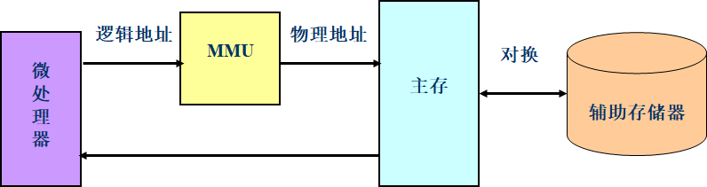
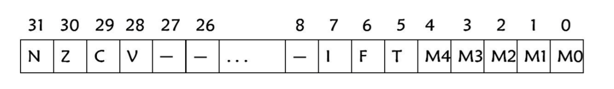
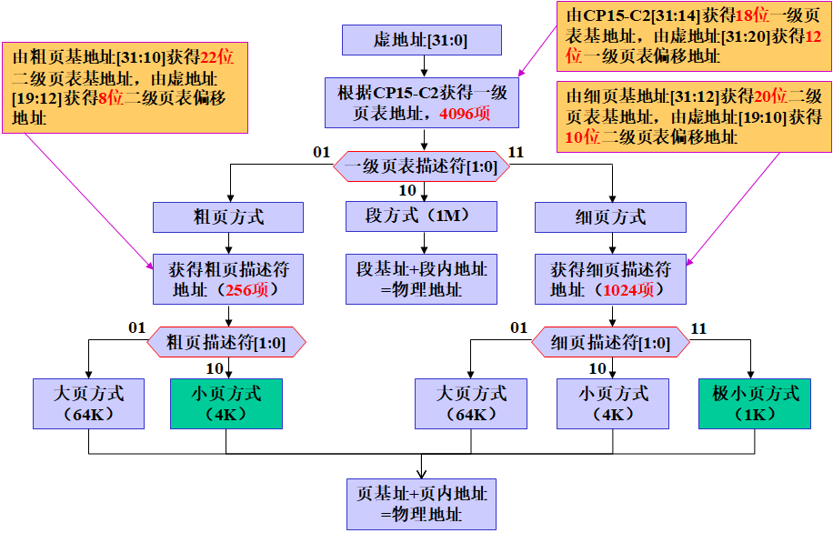
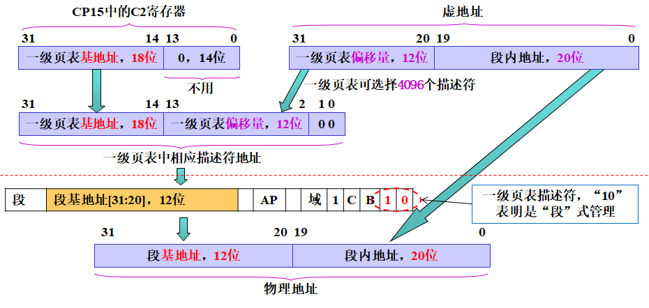

### 第2章 ARM 微处理器概述与编程模型

##### 12. `ARM7` 使用冯诺依曼体系结构, `ARM9` 使用哈佛体系结构.
##### 12.1. **冯诺依曼结构** 概念.
将数据和指令都存储在存储器中.
##### 12.2. **哈佛体系结构** 概念.
为数据和程序提供了各自独立的存储器.

##### 13. ARM 微处理器采用 RISC 架构。
**ARM**, Advanced RISC Machines.

##### 14. ARM 微处理器特点.
采用 **RISC 架构** 的 **ARM 微处理器** 一般具有如下特点:
1. 体积小/低功耗/低成本/高性能;
2. 支持 **Thumb** ($16$ 位) / **ARM** ($32$ 位) 双指令集,能很好的兼容 $8$ 位 / $16$ 位器件;
3. 大量使用寄存器,指令执行速度更快;
4. 大多数数据操作都在寄存器中完成;
5. 寻址方式灵活简单,执行效率高;
6. 指令长度固定.

##### 15. `ARM7` 微处理器 $3$ 级流水线结构, `ARM9` 微处理器 $5$ 级流水线结构.
虽然 `ARM7` 与 `ARM9` 的流水线级数不同,但使用了相同的流水线执行机制,两者的指令执行阶段都处于**第三级**.

##### 16. ARM Cortex 系列的 A 系列 / R 系列 / M 系列及其特点.
**ARMv7架构** 中,内核架构首次从单一款式变成 $3$ 种款式:
**A系列**: Application Processor, 面向尖端的基于虚拟内存的操作系统和用户应用--越来越接近电脑.
**R系列**: Real Time Control, 针对实时系统--既快又实时.
**M系列**: Micro Controller, 对微控制器--单片机风格.

##### 17. ARM 处理器系列,版本体系结构命名规则.
**ARM 处理器系列命名规则**:
命名格式: (12个字段)
```py
'ARM'+x+y+z+'T?D?M?I?E?J?F?S?'
```
`x`: 处理器系列,是共享相同硬件特性的一组处理器的具体实现,例如 `ARM7TDMI`, `ARM740T`, `ARM720T` 都属于 `ARM7` 系列.
`y`: 存储管理/保护单元.
- `2`: **Cache** + **MMU**
- `3`: 改良型 **MMU**
- `4`: **Cache** + **MPU**
- `6`: 无 **Cache**, **MMU** / **MPU**

**MMU**: Memory Management Unit, 内存管理单元,用来管理虚拟存储器和物理存储器的控制线路,同时也负责虚拟地址映射为物理地址. **ARM** 的 **MMU** 作为一个协处理器存在, 编号为 $15.$
**MPU**: Memory Protection Unit, 内存保护单元, **MPU** 中一个域就是一些属性值及其对应的一片内存.这些属性包括:起始地址,长度,读写权限以及缓存等.
`z`: **Cache**.
- `0`: Cache Size variation 1
- `2`: Cache Size variation 2
- `6`: **TCM**

**TCM**: Tightly Coupled Memory, 紧耦合内存, 在 **SoC** 上用专用 **BUS** 与 **CPU** 连接的 **Memory**. 由于是专用 **BUS**, 可以高速访问.
**TCM** 和 **Cache** 的区别:
1. **TCM** 特定的高速空间,可以高速访问.
2. **TCM** 具有物理地址.
3. **TCM** 占用硬件资源比较少.
4. 用途不同: **TCM** 保存常用到的数据,如中断向量表和实时数据,而 **Cache** 只是为了加快处理器和外设之间的数据处理.

在 **ARM** 处理器内核中有多个功能模块可供生产厂商选择.这些模块分别用 `TDMIEJFS` 等来表示,从处理器的内核版本上可以区分出来.
`T`: **Thumb**, **Thumb** $16$ 位译码器, 说明该内核可从 $16$ 位 **Thumb** 指令集扩充到 $32$ 位 **ARM** 指令集. `V4T` 以上版本.
`D`: **Debug**, **JTAG 调试器**, 说明该内核中内置了用于调试的结构,通常它为一个边界扫描链 **JTAG**, 可使 **CPU** 进入调试模式,从而方便地进行断点设置和单步调试.
`M`: **Multipler**, 快速乘法器,内置了硬件乘法器. 包括 $\rm32bit*32bit=64bit$ 和 $\rm32bit*32bit+32bit=64bit$ 两种. `V4` 以上版本.
`I`: Embedded ICE Logic, 嵌入式跟踪宏单元,用于实现断点观测及变量观测的逻辑电路部分,其中的 **TAP 控制器**可接入到边界扫描链.

`E`: **DSP** 增强指令(基于 `TDMI`).
`J`: **Jazelle**, **Java** 加速,这项技术允许直接执行 **Java** 字节代码,获得比基于软件的 **Java虚拟机**(**JVM**) 高得多的性能,比同等非 **Java** 加速核功耗降低 $80\%.$
`F`: **VFP**, Vector Floating Point, 向量浮点单元.
`S`: 可综合 (Synthesizable) 版本. 可综合的,意味着处理器内核是以源代码形式提供的. 这种源代码形式又可以被编译成一种易于 **EDA** 工具使用的形式.
说明: `ARM7TDMI` 之后的所有 **ARM** 内核,即使 `ARM` 后没有包含 `TDMI` 字符,也都默认包含了 `TDMI` 的功能特性.

**ARM 体系结构命名规则**:
命名格式: 
```py
'ARMv'+n+Variants+('x('+Variants+')')
```
`ARMv`: **ARM Version**, 固定字符.
`n`: 指令集版本号. 比如, **ARM** 架构版本发布了 $8$ 个系列,所以 `n` 的取值范围是 $1\sim8$.
`Variants`: 变体.
`x(Variants)`: 排除 `x` 后面指定的变种. `x` 是固定字符,表示不支持括号内的变体. 例如, `ARMv5TxM` 表示 **ARM** 指令集版本为 $5,$ 支持 `T` 变种,不支持 `M` 变种.
说明: **ARM** 处理器有时候还要区分架构版本/处理器核/处理器系列.
例如, `S3C2410`: 采用 `ARMv4T` 架构版本,属于 `ARM920T` 处理器系列,处理器核为 `ARM9TDMI`.

##### 18. 流水线相关问题的解决方法.
流水线中的相关问题: **结构相关**, **数据相关**, **控制相关**.
**结构相关**: 某些指令在流水线中重叠执行时,产生资源冲突.
措施:
1. 采用分离式指令 **Cache** 和数据 **Cache**.
2. **ALU** 中采用单独加法器来完成地址计算.

**数据相关**: 当一条指令需要前面指令的执行结果,而这些指令均在流水线中重叠执行时,就可能引起流水线的数据相关. **数据相关**有**写后读**/**写后写**/**读后写**等.
措施:
1. 旁路技术.
2. 流水线互锁技术. 发生互锁时,流水线停止这个指令的执行.

**控制相关**: 当流水线遇到分支指令和其他会改变 **PC** 值的指令时,就会发生控制相关.
措施:
1. 引入延时分支.
2. 尽早计算出分支转移成功时的 **PC** 值(即分支的目标地址).

##### 19. `ARM9TDMI` 的 `TDMI` 含义.
`T`: **Thumb**, **Thumb** $16$ 位译码器, 说明该内核可从 $16$ 位 **Thumb** 指令集扩充到 $32$ 位 **ARM** 指令集. `V4T` 以上版本.
`D`: **Debug**, **JTAG 调试器**, 说明该内核中内置了用于调试的结构,通常它为一个边界扫描链 **JTAG**, 可使 **CPU** 进入调试模式,从而方便地进行断点设置和单步调试.
`M`: **Multipler**, 快速乘法器,内置了硬件乘法器. 包括 $\rm32bit*32bit=64bit$ 和 $\rm32bit*32bit+32bit=64bit$ 两种. `V4` 以上版本.
`I`: Embedded ICE Logic, 嵌入式跟踪宏单元,用于实现断点观测及变量观测的逻辑电路部分,其中的 **TAP 控制器**可接入到边界扫描链.

##### 20. `CISC` 和 `RISC` 特点与区别.
**CISC**: Complex Instruction Set Computer, 复杂指令集计算机. 随着计算机技术的发展而不断引入新的复杂的指令集,计算机的体系结构会越来越复杂. 据统计, **CISC** 指令中,大约有 $20\%$ 指令会被反复使用,占整个程序代码的 $80\%,$ 而余下的 $80\%$ 指令却不经常使用,在程序设计中只占 $20\%.$
**RISC** : Reduced Instruction Set Computer, 精简指令集计算机. 采用固定长度指令格式. 基本特点如下:
1. 大多数指令只需要执行简单和基本的功能,其执行过程在一个机器周期内完成.
2. 只保留加载/存储指令. 操作数由加载/存储指令从存储器取出放寄存器内操作.
3. 芯片逻辑不采用或少采用微码技术,而采用硬布线逻辑.
4. 减少指令数和寻址方式.
5. 指令格式固定,指令译码简化.
6. 优化编译.

##### 21. ARM 处理器寄存器组织. (P36.2)
共有 $37$ 个寄存器,被分为若干个**组** (**BANK**).
$31$ 个通用寄存器,包括程序计数器 (**PC** 指针), 均为 $32$ 位的寄存器.
$6$ 个状态寄存器,用以标识 **CPU** 的工作状态及程序的运行状态,均为 $32$ 位,目前只使用了其中的一部分.
1. `R13`: `SP`, **堆栈指针**;
2. `R14`: `LR`, **子程序链接寄存器**, 用以保存返回地址;
3. `R15`: `PC`, **程序计数器**.
4. `CPSR`: **当前程序状态寄存器**,包含**条件码标志**, **中断禁止位**, **当前处理器模式**以及其它状态和控制信息. 所有处理器模式下都可以访问 `CPSR`.
5. `SPSR`: 在每种异常模式下都有一个对应的物理寄存器,即**程序状态保存寄存器** `SPSR`. 当异常出现时, `SPSR` 用于保存 `CPSR` 的状态,以便异常返回后恢复异常发生时的工作状态.

所有模式都可以访问**当前程序状态寄存器** `CPSR`, 每种异常都有自己的**保存程序状态寄存器** `SPSR`. 在进入异常时 `SPSR=CPSR`,异常退出时 `CPSR=SPSR`.
**ARM** 处理器又有 $7$ 种不同的处理器模式,在每一种处理器模式下均有一组相应的寄存器与之对应: 在任意一种处理器模式下,可访问的寄存器包括 $15$ 个通用寄存器 `R0`~`R14`, $1\sim2$ 个状态寄存器和程序计数器.

##### 22. ARM 微处理器工作状态. (P36.1)
`ARM7TDMI` 核以后, `T` 变种的 **ARM** 微处理器有两种工作状态: **ARM** 状态, **Thumb** 状态.
**ARM** 指令集和 **Thumb** 指令集均有切换处理器状态的指令,在程序的执行过程中,微处理器可以随时在两种工作状态之间切换,这种切换不影响处理器的工作模式和相应寄存器中的内容. **ARM** 微处理器总是在 **ARM** 状态下开始执行代码.
状态转换时,使用跳转指令 `BX` / `BLX`. 格式: `BX Rm` / `BLX Rm`.
**进入 Thumb 状态**:
1. 当操作数寄存器的 `Rm[0]=1` 时,执行 `BX` 指令,使微处理器从 **ARM** 状态切换到 **Thumb** 状态.
2. 在处理器处于 **Thumb** 状态时,如果发生异常(如 **IRQ** / **FIQ** / **Undef** / **Abort** / **SWI** 等),则异常处理返回时自动切换到 **Thumb** 状态.

**进入 ARM 状态**:
1. 当操作数寄存器的 `Rm[0]=0` 时,执行 `BX` 指令,使微处理器从 **Thumb** 状态切换到 **ARM** 状态.
2. 在进行异常处理时,把 **PC 指针** 放入异常模式链接寄存器中,并从异常向量地址开始执行程序,也可以使处理器切换到 **ARM** 状态.

##### 23. ARM 体系结构的存储器格式. (P.36.3)
**大端模式**,**小端模式**.

##### 24. ARM 的数据类型. (P36.5)
**ARM** 有六种数据类型:
1. $\rm8bit$ 有符号/无符号**字节**.
2. $\rm16bit$ 有符号/无符号**半字**,以 $\rm2B$ 的边界对齐.
3. $\rm32bit$ 有符号/无符号**字**,以 $\rm4B$ 的边界对齐.

##### 25. MMU 的作用.

**MMU**: Memory Management Unit, 内存管理单元,用来管理虚拟存储器和物理存储器的控制线路,同时也负责虚拟地址映射为物理地址. **ARM** 的 **MMU** 作为一个协处理器存在, 编号为 $15.$
用于在 **CPU** 和**物理内存**之间进行地址转换.
内存映射: 将地址从逻辑空间映射到物理空间的过程.
在 **ARM** 系统中,**MMU** 主要完成的工作:
1. 将虚地址转换成物理地址;
2. 控制内存的访问权限.

**MMU** 关闭时,虚地址直接输出到物理地址总线.
虚拟地址存储系统示意图:


##### 26. `ARM920T` 支持的 $4$ 种存储块块管理方式.
1. **段** (Section): 以 $\rm1MB$ 为存储块单位.
2. **大页** (Large Pages): 以 $\rm64KB$ 为存储块单位.
3. **小页** (Small Pages): 以 $\rm4KB$ 为存储块单位.
4. **极小页** (Tiny Pages): 以 $\rm1KB$ 为存储块单位.

##### 27. ARM 虚地址到物理地址的变换过程.
PPT 2.64~72.

##### 28. 一级页表/二级页表的页描述符中相应的段/页的基地址位数.
一级页表的基地址: $\rm32bit,$ 高 $\rm18bit$ 有效.
PPT 2.65~66.

##### 29. MMU 地址变换流程.
PPT 2.73

##### 30. ARM 存储器访问故障检测方法.
**地址对齐失效** / **地址变换失效** / **域控制失效** / **访问权限控制失效**.

##### 31. ARM 微处理器 $7$ 种工作模式. (P36.4)
处理器的各种工作模式由当前程序状态寄存器 `CPSR` 的低 $5$ 位 `M[4:0]` 决定.
不同的工作模式间可以相互切换,有两种方式:
1. 发生异常时,处理器自动改变 `CPSR` 中 `M[4:0]` 的值,进入相应的工作模式;
2. 处理器处于特权模式时,用指令向 `CPSR` 的 `M[4:0]` 字段写入特定的值,进入相应的工作模式.

用户模式时,不能改变工作模式,除非发生异常.

&nbsp;

|处理器模式|说明|备注|`M[4:0]`|
|-|-|-|-|
**用户** (usr)      |正常程序执行模式               |不能直接切换到其它模式             |`10000`
**快速中断** (fiq)  |支持高速数据传输及通道处理      |**FIQ** 异常响应时进入此模式       |`10001`
**外部中断** (irq)  |用于通用中断处理               |**IRQ** 异常响应时进入此模式       |`10010`
**管理** (svc)      |操作系统保护模式               |系统复位和软件中断响应时进入此模式  |`10011`
**中止** (abt)      |用于支持虚拟内存和/或存储器保护 |在 `ARM7TDMI` 没有大用处          |`10111`
**未定义** (und)    |支持硬件协处理器的软件仿真      |未定义指令异常响应时进入此模式     |`11011`
**系统** (sys)      |运行操作系统的特权任务         |与用户模式类似,但具有可以直接切换到其它模式等特权|`11111`

##### 32. ARM 寄存器结构与分组.
PPT 2.81~92.

##### 35. **ARM** 体系结构支持的异常类型有哪些?说明各种异常的向量地址. (P36.8)
**ARM** 微处理器有 $7$ 种类型异常.
**复位**: 当发生**复位异常**时,处理器立即停止当前程序,进入禁止中断的管理模式,并
从地址 `0x00000000` 或 `0xFFFF0000` 处开始执行.
**未定义指令**: **ARM** 处理器认为当前指令未定义时,便产生了未定义指令中断. 该异常可用于协处理器软件仿真.
**软件中断**: 当用户模式下的程序使用指令 `SWI` 时,处理器便产生软件中断,进入管理模式,以调用特权操作.
**指令预取中止**: 当处理器预取指令的地址不存在,或该地址不允许当前指令访问,存储器会向处理器发出中止信号. 只有当预取的指令被执行时,才会产生指令预取中止异常.
**数据访问中止**: 若处理器数据访问指令的地址不存在,或该地址不允许当前指令访问时,就会产生数据中止异常.
**外部中断请求**: 当处理器的外部中断请求引脚有效,而且 `CPSR` 中的 `I` 位为 `0` 时,就会产生 **IRQ 异常**. 系统的外设可通过该异常请求中断服务.
**快速中断请求**: 处理器的快速中断请求引脚有效,而且 `CPSR` 中的 `F` 位为 `0` 时,将产生 **FIQ 异常**.

|异常类型               |工作模式           |特定地址(低端)|特定地址(高端)|优先级|
|-|-|-|-|-|
**复位**                |管理模式           |`0x00000000`|`0xFFFF0000`|$1$
**未定义指令**          |未定义指令中止模式  |`0x00000004`|`0xFFFF0004`|$6$
**软件中断** (SWI)      |管理模式           |`0x00000008`|`0xFFFF0008`|$6$
**指令预取中止**        |中止模式           |`0x0000000C`|`0xFFFF000C`|$5$
**数据访问中止**        |中止模式           |`0x00000010`|`0xFFFF0010`|$2$
**外部中断请求** (IRQ)  |外部中断模式       |`0x00000018`|`0xFFFF0018`|$4$
**快速中断请求** (FIQ)  |快速中断模式       |`0x0000001C`|`0xFFFF001C`|$3$

##### 36. 异常的响应和返回.
异常发生会使得正常的程序流程被暂时停止,例如 `ARM9` 处理器响应 **IRQ 异常**:
处理器进入异常处理程序前,应该保存其当前的状态,以便当异常处理程序完成后,处理器能回到原来程序的断点处继续执行.
**对异常的响应**:
1. 将下一条指令的地址存入相应连接寄存器 `LR`, 以便程序在处理异常返回时能从正确的位置重新开始执行.
   - 异常从 **ARM** 状态进入: `LR` 寄存器中保存的是下一条指令的地址 (一般是当前 `PC-4`, 与异常的类型有关);
   - 异常从 **Thumb** 状态进入: `LR` 寄存器中保存当前 `PC` 的偏移量,这样,异常处理程序就不需要确定异常是从何种状态进入的.
2. 将 `CPSR` 复制到相应的 `SPSR` 中.
3. 根据异常类型,强制设置 `CPSR` 的运行模式位.
4. 强制 `PC` 从相关的异常向量地址取一条指令执行,从而跳转到相应的异常处理程序处,同时设置中断禁止位,以禁止中断发生.

注意: 如果异常发生时,处理器处于 **Thumb** 状态,则当异常向量地址加载入 `PC` 时,处理器自动切换到 **ARM** 状态.

**异常返回**:
异常处理完毕之后, **ARM** 微处理器会执行以下几步操作从异常返回:
1. 将链接寄存器 `LR` 的值减去相应的偏移量后送到 `PC` 中.
2. 将 `SPSR` 复制回 `CPSR` 中.
3. 若在进入异常处理时设置了中断禁止位,要在此清除.

注意: 恢复 `CPSR` 的动作会将 `T`, `F`, `I` 位自动恢复为异常发生前的值.

##### 37. 异常处理时保存在 `R14` 中值, `PC` 更新情况,返回指令.
$X=$ 当前执行指令地址.
执行当前指令时 `LR`中保存的值: 除**复位**外均为 `PC-4`.
|异常及指令     |`PC`更新情况   |返回位置   |返回指令   |
|-|-|-|-|
**`BL` 指令**   |未更新|$X$ 的下一条指令地址|`MOV  PC,R14`
**复位**|
**数据中止**    |已更新|$X$               |`SUBS PC,R14_abt,#8`
**FIQ**        |已更新|$X$ 的下一条指令地址|`SUBS PC,R14_fiq,#4`
**IRQ**        |已更新|$X$ 的下一条指令地址|`SUBS PC,R14_irq,#4`
**预取中止**    |未更新|$X$               |`SUBS PC,R14_abt,#4`
**SWI**        |未更新|$X$ 的下一条指令地址|`MOVS PC,R14_svc`
**未定义指令**  |未更新|$X$ 的下一条指令地址|`MOVS PC,R14_und`

#### 教材复习题及课外练习题

##### 0.6 `ARM920T` 微处理器核的 **MMU** 采用什么管理方式?

##### 0.7 叙述 `CPSR` 寄存器及其各位数据位的作用. (P36.7)
`CPSR` 是当前程序状态寄存器,是在任何模式下都可以访问的通用状态寄存器,它包括条件标志位,中断禁止位,当前处理器模式标志位,以及其他一些相关的控制和状态位:
1. **条件码标识**: `N` `Z` `C` `V` 均为**条件码标识**,它们的内容可被算术或逻辑的结果所改变,并且可以决定某条指令是否被执行.
2. **控制位**: `CPSR` 的低 $8$ 位称为**控制位**,当发生异常时这些位可被改变,如果处理器运行**特权模式**,这些位也可以由程序修改.
3. **保留位**: `CPSR` 中的其余位为**保留位**,当改变 `CPSR` 中的条件码标志位或者控制位时保留位不要被改变,在程序中也不要使用保留位来存储数据.

##### 45. ARM 处理器结构体系中具有 `T` 变种处理器核可以工作在 `ARM` 状态和 `Thumb` 状态.

##### 46. `ARM9` 处理器的当前程序状态寄存器结构如图所示,请说明各位的功能.

`N`: **负标志位**, 运算结果的第 $31$ 位值,记录标志设置的结果.
`Z`: **零标志位**, 如果标志设置操作的结果为 $0,$ 则置位.
`C`: **进位标志位**, 记录无符号加法溢出,减法无错位,循环移位.
`V`: **溢出标志位**, 记录标志设置操作的有符号溢出.
`I`: **中断禁止标志位**, 置位时禁止 **IRQ 中断**, 否则允许 **IRQ 中断**使能.
`F`: **中断禁止标志位**, 置位时禁止 **FIQ 中断**, 否则允许 **FIQ 中断**使能.
`T`: **控制位**, 置位时处理器运行在 **Thumb** 状态下,清零时处理器运行在 **ARM** 状态下.
`M0`~`M4`: **模式控制位**, 定义处理器的 $7$ 种模式.

##### 47. `S3C2440` 具有多少通用 I/O 口?它们具有哪些功能?

##### 48. `CPSR` 是当前程序状态字,其作用是保存状态和工作模式.

##### 49. ARM 处理器复位后,强制为管理模式,并进入 **ARM** 状态,进而执行.√

##### 50. `S3C2440` 具有 $60$ 个中断源.

##### 53. CPU 和内存之间进行地址转换时, `MMU` 将地址从虚拟地址空间映射到物理地址空间.
**A. MMU**
B. TCB
C. DMA
D. Cache

##### 54. 以冯诺伊曼结构为体系结构的是 `ARM7`.
**A. `ARM7`**
B. `ARM9`
C. `ARM10`
D. `ARM11`

##### 51. 画图说明 `S3C2440` MMU 地址变换流程.


##### 52. 画图说明 `S3C2440` MMU 段地址变换过程.


##### 55. 下面哪一种工作模式不属于 ARM 特权模式 `用户模式`.
**A. 用户模式**
B. 管理模式
C. 软中断模式
D. FIQ 模式

##### 56. `ARM7TDMI` 中的 `TDSI` 分别表示什么含义?
`T`: 支持高密度 $16$ 位的 **Thumb** 指令集.
`D`: 支持片上调试.
`S`: `ARM7TDMI` 的可综合 (Synthesizable) 版本 (软核).
`I`: 支持 **EmbededICE** 观察硬件.
`M`: 支持 $64$ 位乘法.

##### 57. 异常响应时,处理器处于何种状态.
进行异常响应时,处理器会自动进入 **ARM** 状态.
即使是一个单纯的 **Thumb** 应用系统,也必须加一个汇编的交互头程序,因为系统总是自动
从 **ARM** 开始启动.

##### 59. IRQ 中断处理程序可以执行指令 `SUBS PC,R14_irq,#4` 从 IRQ 中断返回,说明指令中 `-4` 的原因.
三级流水线,产生 **IRQ** 后, `PC` 已经更新.

##### 62. ARM 采用 `RISC` 体系结构.

##### 63. ARM 是指 `Advanced RISC Machines`, 先进精简指令集机器.

##### 64. 哈佛体系结构为数据和程序提供了各自独立的存储器,程序计数器只指向 `程序存储器` 而不指向 `数据存储器`.

##### 65. `小端模式`含义是: `从存储器读数据或向存储器写数据,字数据与存储器存储对应关系为低存低,高存高`.

##### 66. 当 ARM 微处理器执行 $16$ 位的 Thumb 指令集时,工作在 `Thumb 状态`.

##### 67. `ARM7` 是一种低电压通用 $32$ 位 RISC 微处理器单元.

##### 68. ARM 指令都是 $32$ 位的字,必须以字为单位边界对齐.

##### 69. `S3C2440` 共有 $37$ 个寄存器,各寄存器均为 $32$ 位.

##### 70. ARM 处理器的工作状态包括 `ARM 状态 / Thumb 状态`.
A. **ARM** 状态 / **CPU** 状态.
B. **CPU** 状态 / 存储器状态
**C. ARM 状态 / Thumb 状态**
D. 存储器状态 / **Thumb** 状态

##### 71. ARM 处理器复位后,执行 `强制为管理模式,并进入 ARM 状态,进而执行`.
A. 强制为**用户模式**,并进入 **ARM** 状态,进而执行
B. 强制为**用户模式**,并进入 **Thumb** 状态,进而执行
C. 强制为**管理模式**,并进入 **ARM** 状态,进而执行
D. 强制为**管理模式**,并进入 **Thumb** 态,进而执行

##### 72. ARM 处理器异常的优先级如何定义?
异常中断的优先级: **复位** (最高优先级) > **数据异常中止** > **FIQ** > **IRQ** > **预取指异常中止** > **SWI** > **未定义指令** (包括缺协处理器).

##### 73. 若寄存器 `R1=0x01020304`, 分别按小端模式和大端模式存储在 `0x30000` 字单元中,试分别列出两种模式下内存存储内容,并标出内存地址.

##### 74. 假设 `R0` 的内容为 `0x1000`, 寄存器内容 `R1=0x11223344,R2=0x55667788`, 按小端存储模式,所有存储器字节单元内容为 `0`. 连续执行下述指令后,分析每条指令执行后,寄存器 `R0` `R1` `R2` 内容如何变化,存储器相关字节单元内容如何变化.
```nasm
STMIB R0!,{R1,R2}
LDMIA R0!,{R1,R2}
```

执行 `STMIB R0!,{R1,R2}` 后: 
```py
R0=0x1008
R1=0x11223344 #不变
R2=0x55667788 #不变
```
产生变化的存储器字节单元:
```py
[0x1004]=0x44
[0x1005]=0x33
[0x1006]=0x22
[0x1007]=0x11
[0x1008]=0x88
[0x1009]=0x77
[0x100A]=0x66
[0x100B]=0x55
```
2. 继续执行 `LDMIA R0!,{R1,R2}`后:
```py
R0=0x1010
R1=0x55667788
R2=0
```
存储器字节单元不变化.

##### 75. ARM 处理器模式和 ARM 处理器状态有什么区别?说明具体的工作模式和工作状态. 
**ARM** 处理器模式指 **用户模式** / **快中断模式** / **中断模式** / **管理模式** / **中止模式** / **未定义模式** / **系统模式**.
**ARM** 处理器状态指 **ARM** 状态和 **Thumb** 状态.
**ARM** 两种处理器状态下均有上述 $7$ 种模式.

##### 76. `ARM9` 中 `CPSR` 的作用是什么? `ARM9` 条件码 `GE` 的含义是什么?
`CPSR` 作用: **当前程序状态字**, 保存状态和工作模式.
`GE` 含义: 有符号大于等于.

##### 77. 简述 ARM 处理器的小端模式和大端模式存储器组织.
小端存储器组织是较高的有效字节存放在较高的存储器地址,较低的有效字节存放在较低的存储器地址. 大端存储器组织是较高的有效字节存放在较低的存储器地址,较低的有效字节存放在较高的存储器地址.

##### 83. `CPSR` 寄存器中的 `Z` 位为 `1` 表示 `运算结果为零`.

##### 84. 复位异常时,处理器立即停止当前程序,进入禁止中断的管理模式,并从地址 `0x00000000` 处开始执行.

##### 85. 在 ARM 处理器中, `CPSR` 寄存器包括可控的全局中断禁止位,控制中断禁止位就可以打开或者关闭中断.
**A. `CPSR`**
B. `SPSR`
C. `PC`
D. `IR`

##### 87. `CPSR` 寄存器中 `C` 标志位的含义是 `进位标志`.
A. 状态选择
B. 中断允许
C. 符号标志
**D. 进位标志**


##### 89. `ARM7` 微处理器的哪种工作状态对寄存器的访问受到一定限制,并说明受到怎样的限制.
**Thumb** 状态对寄存器的访问受到一定限制: **Thumb** 指令对 `R8~R15` 寄存器的访问受到一定限制.

##### 90. 说明 ARM 的 $3$ 级流水线和 $5$ 级流水线.

##### 93. 解释中断处理中 ISR 与 FIQ 的区别

##### 94. `ARM9` 处理器如何保证 FIQ 异常响应的快速性?
为 **FIQ** 设置了独立的 `R8~R12` 寄存器,实现寄存器快速切换;
`CPSR` 和 `SPSR` 也是独立的.

##### 95. 在 ARM 微处理器系列中, `ARM9TDMI` / `ARM920T` / `ARM926EJ-S` 中的字母 `TDMIEJS` 各自代表什么含义?
`T`: 支持 $\rm16bit$ 压缩指令集 **Thumb**, 称为 `T` 变种;
`D`: 支持片上 **Debug**,称为 `D` 变种;
`M`: 内嵌硬件乘法器 **Multiplier**, 支持长乘指令,称为 `M` 变种;
`I`: 嵌入式 **ICE**, 支持片上断点和调试,称为 `I` 变种;
`E`: 表示支持增强型 **DSP** 指令,称为 `E` 变种;
`J`: 表示支持 **Java** 加速器 **Jazelle**, 称为 `J` 变种;
`-S`:  表示是 **ARM** 可综合版本.

##### 96. FIQ 中断的入口地址是 `0x0000001C`.
**A. `0x0000001C`**
B. `0x00000008`
C. `0x00000018`
D. `0x00000014`

##### 97. 寄存器 `R15` 除了可以做通用寄存器外,还可以做 `程序计数器`.
**A. 程序计数器**
B. 链接寄存器
C. 堆栈指针寄存器
D. 基址寄存器

##### 98. 下列关于存储管理单元 (MMU) 说法错误的是 `在带 MMU 的操作系统控制下,运行的任务必须知道其他与之无关的任务的存储需求情况,这就简化了各个任务的设计`.
A. **MMU** 提供的一个关键服务是使各个任务作为各自独立的程序在其自己的**私有存储空间**中运行.
**B. 在带 MMU 的操作系统控制下,运行的任务必须知道其他与之无关的任务的存储需求情况,这就简化了各个任务的设计.**
C. **MMU** 提供了一些资源以允许使用**虚拟存储器**.
D. **MMU** 作为转换器,将程序和数据的**虚拟地址**(编译时的连接地址)转换成实际的**物理地址**,即在物理主存中的地址.

##### 99. 下列 `CPSR` 寄存器标志位的作用说法错误的是 `V: 借位`.
A. `N`: 负数
B. `Z`: 零
C. `C`: 进位
**D. `V`: 借位**

##### 101. 对于 ARM 系列,最适合高端应用的嵌入式处理器是 `ARM Cortex-A`.
A. `ARM9`
B. `ARM Cortex-M`
**C. `ARM Cortex-A`**
D. `ARM Cortex-R`
**解析**: **ARM** 公司在经典处理器 `ARM11` 以后的产品改用 `Cortex` 命名,并分成 `A` `R` `M` 三类,旨在为各种不同的市场提供服务. 其中, `A` 系列面向尖端的基于虚拟内存的操作系统和用户应用, `R` 系列针对实时系统, `M` 系列对微控制器. 故本题选 **C**.

##### 102. 以下关于 ARM 程序状态寄存器 `CPSR` 说法错误的是 `CPSR 决定堆栈深度`.
A. `CPSR` 记录了 **ARM** 运行过程中的标志状态
B. `CPSR` 决定是否切换到 **Thumb** 状态
C. `CPSR` 决定是否允许**快速中断 FIQ**
**D. `CPSR` 决定堆栈深度**
**解析**: `CPRS` 为**当前程序状态寄存器**,记录了 **ARM** 运行过程中的标志状态. 其中 `T` 为 **ARM** 与 **Thumb** 指令切换, `F` 为**禁止快速中断 FIQ** 的**控制位**. 因此 **A**/**B**/**C** 项正确,本题选 **D**.

##### 103. 关于 ARM 处理器异常中断响应过程中,以下说法正确的是 `设置当前状态寄存器 CPSR 的相应位`.
A. `SPSR` 的值保存到 `CPSR` 中
**B. 设置当前状态寄存器 `CPSR` 的相应位**
C. 断点地址会自动保存在 `R13` 中
D. 自动把异常向量地址写入 `R14` 中
**解析**: **ARM** 对异常的响应过程如下: 将 `CPRS` 的值保存到将要执行的异常中断对应的各自 `SPSR` 中; 设置 `CPSR` 的相应位; 将引起异常指令的下一条地址(断点地址)保存到 `R14` 中; 给 `PC` 强制赋值,转入向量地址,以便执行相应的处理程序. 故本题 **B** 项正确.

##### 104. 关于 ARM 处理器的 MMU, 以下说法错误的是 `MMU 通过查 TLB 表得到虚拟地址`
A. **MMU** 是存储器管理部件
B. **MMU** 控制存储器访问顺序
C. **MMU** 控制存储器的访问权限
**D. MMU 通过查 TLB 表得到虚拟地址**
**解析**: **MMU** 是 **CPU** 中用来管理虚拟存储器/物理存储器的控制线路,同时也负责**虚拟地址**映射为**物理地址**,以及提供硬件机制的内存访问授权; **MMU** 进行**虚拟地址**到**物理地址**的转换通过查找页表来完成,每次在访问内存时先查 **TLB**, 查不到时再到内存中去查整个页表. 故 **MMU** 通过查 **TLB** 表得到的是 **物理地址**, **D** 项错误.

##### 105. 下面关于 AMBA 的叙述中,错误的是 `ARM7 和 ARM11 采用的 AMBA 的版本相同`.
A. **ARM** 公司定义的 **AMBA** 其中文名为 `先进微控制器总线体系结构`.
B. **ARM** 公司定义的 **AMBA** 是用于连接和管理片上系统中各功能模块的开放标准和片上互连规范.
C. 至 $2011$ 年, **AMBA** 已从 `AMBA1.0` 发展到了 `AMBA4.0`.
**D. `ARM7` 和 `ARM11` 采用的 `AMBA` 的版本相同.**
**解析**: **AMBA** 是 **ARM** 公司公布的总线协议,其中文名为 `先进微控制器总线体系结构`, 用于连接和管理片上系统中各功能模块的开放标准和片上互连规范. **AMBA** 有多个版本,至 $2011$ 年, **AMBA** 已从 `AMBA1.0` 发展到了 `AMBA4.0`, 性能随版本的发展而逐步提高, `ARM7` 采用 `AMBA1`, 而 `ARM9` 采用 `AMBA2`. 故本题选 **D**.

##### 106. 下面与嵌入式处理器复位相关的叙述中,错误的是 `ARM 复位后 PC 指针指向的地址是可选的`.
A. 一般情况下,为保证系统可靠复位,复位信号有效电平的时间宽度必须为若干个处理器时钟周期.
**B. **ARM** 复位后 `PC` 指针指向的地址是可选的.**
C. 嵌入式系统可使用外接典型复位芯片来保证系统可靠复位.
D. 当嵌入式处理器的复位引脚标记为 `nRESET` 时,表示低电平复位.
**解析**: 一般情况下,为保证系统可靠复位,复位信号有效电平的时间宽度必须为若干个处理器时钟周期; 嵌入式系统可使用外接典型复位芯片来保证系统可靠复位; 嵌入式处理器都有一个系统复位引脚为 `nRESET` 或 `RESET`, `n` 表示低电平复位,不带 `n` 的表示高电平复位; **ARM** 复位后 `PC` 无条件的指向 `0x00000000` 处. 故 **B** 项错误.

##### 107. 下面是关于基于 ARM 内核的嵌入式芯片中的中断控制器的叙述,其中错误的是 `中断控制器是连接 AMBA 的系统总线和外围总线的桥接器`.
**A. 中断控制器是连接 AMBA 的系统总线和外围总线的桥接器**
B. 一般采用向量中断或嵌套向量中断方式管理中断
C. 向量中断区分中断的优先级,并且每个中断都有各自的**中断处理程序地址**
D. 高优先级的中断可以进入低优先级中断的处理过程中,待高优先级中断处理完成后再继续执行低优先级中断处理
**解析**: 连接 **AMBA** 的系统总线和外围总线的是桥接器, **DMA** 连接在 **AMBA** 的系统总线上,故 **A** 错误; **DMA** 一般采用向量中断或嵌套向量中断方式管理中断,向量中断区分中断的优先级,并且每个中断都有各自的中断处理程序地址,高优先级的中断可以进入低优先级中断的处理过程中,待高优先级中断处理完成后再继续执行低优先级中断处理. 故本题选 **A**.
