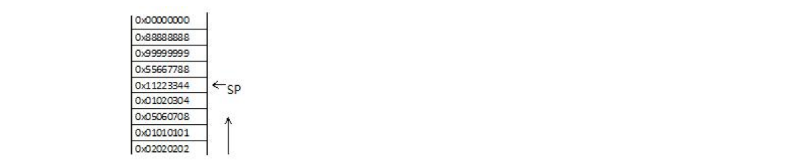
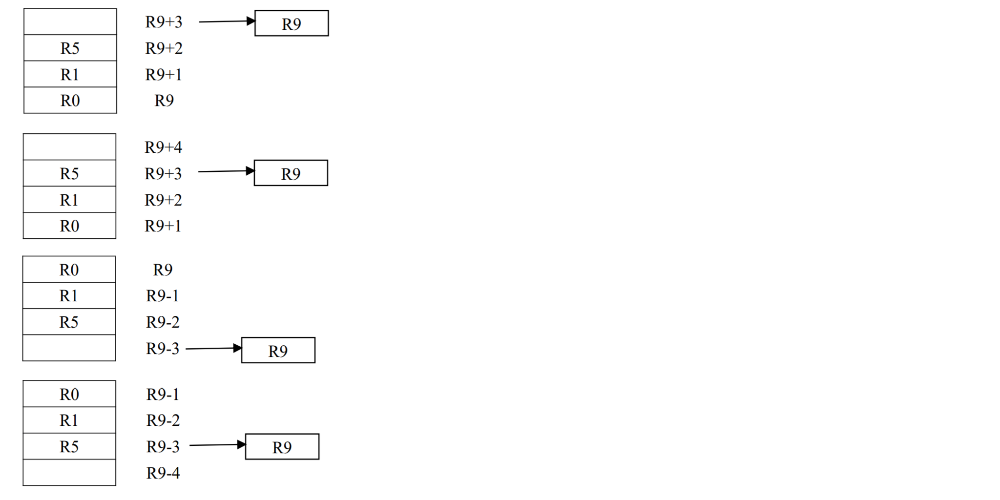
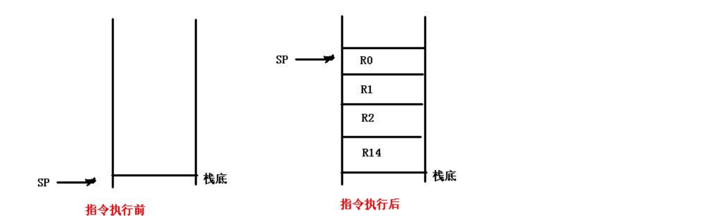
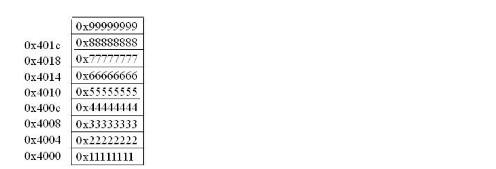

### 第3章 `ARM9` 指令系统

#### 复习概要

##### 38. ARM 指令系统的 $8$ 种寻址方式. (P59.1)
**寻址方式**, 就是根据指令中操作数的信息寻找操作数实际**物理地址**的方式.

**1. 寄存器寻址**:
在寄存器寻址方式下,寄存器的值即为操作数.
ARM指令普遍采用此种寻址方式.
```nasm
ADD R0, R1, R2  ;R0=R1+R2
MOV R0, R1
```

**2. 立即寻址**:
操作数直接在指令中给出,取出指令的同时获得操作数. 这个操作数称**立即数**.
```nasm
ADD R0, R1,     #5  ;R0=R1+5
MOV R0, #0x10
```

**3. 寄存器间接寻址**:
操作数存储在存储器中，寄存器的值为操作数的物理地址。
```nasm
STR R0, [R1]    ;[R1]=R0
LDR R0, [R1]    ;R0=[R1]
```

**4. 变址寻址**:
操作数存储在存储器中,寄存器的值与指令中给出的偏移地址量相加为操作数的**物理地址**. 这个寄存器称为基址寄存器.
**变址寻址**方式常用于访问某基地址附近的地址单元.
```nasm
LDR R0, [R1,#5] ;R0=[R1+5]
LDR R0, [R1,R2] ;R0=[R1+R2]
```

**5. 寄存器移位寻址**:
操作数由寄存器的数值做相应移位而得到. 移位的方式在指令中以助记符的形式给出,位数用立即数或寄存器寻址方式表示.
它是 **ARM** 指令集独有的寻址方式. 可完成对通用寄存器中的内容进行**逻辑/算术/循环左移**操作,按操作数 (**通用寄存器**或立即数 $0\sim31$) 所指定的数量向左/右移位,低位用 `0`/最高位填充,最后一个左/右移出的位放在状态寄存器的 `C` 位.
共有 $5$ 种位移操作:
`LSL` / `ASL` **逻辑(算术)左移**;
`LSR` **逻辑右移**;
`ROR` **循环右移**;
`ASR` **算术右移**;
`RRX` **带扩展的循环右移**.

```nasm
MOV R0, R1, LSL #4  ;R0=R1<<4
MOV R0, R1, LSR #4  ;R0=(R1>>4)&((1<<(32-4))-1)
MOV R0, R1, ROR #4  ;R0=R1<<(32-4)|LSR(R1,4)
MOV R0, R1, ASR #4  ;R0=R1>>4
MOV R0, R1, RRX #4  ;R0=ROR(ROR(ROR(ROR(R1,1),1),1),1) # Step by Step
```

**6. 多寄存器寻址**:
将以寄存器的值为起始地址的字依次装入寄存器中. 一次对多个寄存器寻址,多个寄存器由小到大排列, 一条指令可实现一组寄存器值的传送. 最多可传送 $16$ 个寄存器.
```nasm
LDMIA   R0, {R1-R4} ;R1=[R0]
                    ;R2=[R0+4]
                    ;R3=[R0+8]
                    ;R4=[R0+12]
```

**7. 堆栈寻址**:
**堆栈**: 按照**先进后出**原则组织的特定的数据存储的区域.
使用专门的寄存器 (堆栈指针, `SP`, `R13`) 指向堆栈栈顶.
用于数据栈与寄存器组之间批量数据传输,便于解决数据写入和读出的顺序不同时的问题.
```nasm
STMFD   R13!,   {R0,R1,R2,R3,R4};将R0~R4中的数据压入堆栈,R13为堆栈指针
LDMFD   R13!,   {R0,R1,R2,R3,R4};将数据出栈,恢复R0~R4原先的值
```

**8. 相对寻址**:
类似**变址寻址**,只是将程序计数器 `PC` 作为基址寄存器,指令中的标记作为地址偏移量.
```php
BEQ funcname
```

##### 39. 有效立即数的判断.
一个 $32$ 位数用 $12$ 位编码表示,符合以下规则才是**合法常数**(**有效立即数**) `C=ROR(immed_8,2*rotate_imm_4)`.
**e.g.**
汇编指令:
```nasm
mov R0, #0x0000f200
```
机器指令: 
`0xe3a00cf2`
其中 `0xcf2` 为立即数: `immed_8=0xf2, rotate_imm_4=0xc`.
`0x0000f200=ROR(0xf2,0xc)`
*`ROR` 为循环右移,循环左移可以通过循环右移实现.

##### 41. ARM 指令中 `S` 的作用.
决定指令执行是否影响 `CPSR` 寄存器的值.

##### 42. 主要条件码.
`EQ` `NE` `CS`/`HS` `CC`/`LO` `HI` `LS`

##### 43. 主要指令.
`MOV` `ADD` `ADC` `SUB` `SBC` `AND` `ORR` `EOR` `BIC` `CMP` `TST` `B` `BL` `LDR` `LDRB` `STR` `STRB` `LDMFD` `STMFD` `SWI`

##### 44. `Load` / `Store` 指令伪代码解释
`LDR {<cond>}<Rd>, <addressing_mode>`
```py
if ConditionPassed(cond):
    # if adderss[1:0]==0b00:
    #     value=Memory[adderss,4]
    # elif adderss[1:0]==0b01:
    #     value=ROR(Memory[adderss,4],8)
    # elif adderss[1:0]==0b10:
    #     value=ROR(Memory[adderss,4],16)
    # elif adderss[1:0]==0b11:
    #     value=ROR(Memory[adderss,4],24)
    value=ROR(Memory[adderss,4],adderss[1:0]*8)
    if Rd is R15:
        if architecture version 5 or above:
            PC=value&0xfffffffe
            T_Bit=value[0]
        else:
            PC=value&0xfffffffc
    else:
        RD=value
```

##### 45. LDM 的 type 字段类型.
共有 $8$ 种:
**基本传送类型**(用于一般数据传送):
`IA`: 每次传送后地址加
`IB`: 每次传送前地址加
`DA`: 每次传送后地址减
`DB`: 每次传送前地址减
**堆栈传送类型**(用于**堆栈**数据传送):
`FD`: 满递减堆栈
`ED`: 空递减堆栈
`FA`: 满递增堆栈
`EA`: 空递增堆栈

##### 46. LDM 指令操作的伪代码解释.
`LDM {<cond>} <addressing_mode> <Rd> {!}, <registers>`
```py
if ConditionPassed(cond):
    adderss=start_address
    for i in range(14):
        if Ri==1:
            Ri=Memory[adderss,4]
            adderss=address+4
    if R15==1:
        value=Memory[adderss,4]
        if architecture version 5 or above:
            PC=value&0xfffffffe
            T_Bit=value[0]
        else:
            PC=value&0xfffffffc
        adderss=address+4
    assert end_adderss=address-4 
```

##### 47. SWI 指令操作的伪代码解释.
`SWI {<cond>} <immed_24>`
```py
if ConditionPassed(cond):
    R14_svc=adderss of next instruction after the SWI instruction
    SPSR_svc=CPSR
    CPSR[4:0]=0b10011   # 进入管理模式
    CPSR[5]=0           # Execute in ARM state, T Bit = 0
                        # CPSR[6] is unchanged, fiq不变
    CPSR[7]=1           # Disable normal interrupt, I Bit = 1, 禁止irq
    if high vectors configured:
        PC=0xffff0008
    else:
        PC=0x00000008
```

#### 教材复习题及课外练习题

教材 P59: 7,9

##### 118. 简述 `ARM9` 的 `LDM` / `STM` 指令中空/满/递增/递减的含义. (P60.6)
当堆栈指针指向下一个将要放入数据的空位置时,称为空堆栈;
当堆栈指针指向最后压入堆栈的数据时,称为满堆栈;
当堆栈由低地址向高地址生成时,称为递增堆栈;
当堆栈由高地址向低地址生成时,称为递减堆栈.

##### 119. BIC 指令的作用是什么? (P60.8)
**BIC**: 位清除指令
`BIC{<cond>}{S} <Rd>, <Rn>, <op2>`
`Rd=Rn&(~op2)`
用于清除寄存器 `Rn` 中的某些位,并把结果存放到目的寄存器 `Rd` 中.
操作数 `op2` 是一个 $32$ 位**掩码**(**mask**), 如果在**掩码**中设置了某一位,则清除(置 `0`) `Rn` 中的这一位; 未设置的掩码位指示 `Rn` 中此位保持不变.
`op2`: 寄存器/被移位的寄存器/立即数.
**e.g.**
`R0=0x1234abcd`
```nasm
BIC R0, R0, #5
```
```py
5=          0000 0000 0000 0000 0000 0000 0000 0101
~5=         1111 1111 1111 1111 1111 1111 1111 1010
0x1234abcd= 0001 0010 0011 0100 1010 1011 1100 1101
result=     0001 0010 0011 0100 1010 1011 1100 1000
```

##### 120. `BX` 和 `BL` 指令有什么不同? (P60.10)
`BX` 指令是分支和交换指令,寄存器的地址是目标地址. 其中的 `bit[0]` 不是地址信息. 当寄存器的 `bit[0]` 为 `1` 时,表明目标地址处是 **Thumb** 指令; 当寄存器的 `bit[0]` 为 `0` 时,表明目标地址是 **ARM** 指令. 此时,要求字对准.
`BL` 指令是分支和链接指令,将一条指令的地址复制到 `R14`, 并引起处理器移位到目标地址,但目标地址不可以是 **ARM** 指令. `BL` 指定不能转移到当前指令 $\rm+4MB$ 以外的地址.
`BX` 指令: 带切换分支转移, $\rm4G$ 范围.
`BL` 指令: 保存返回地址的转移,范围有限,小于 $\rm4G.$

##### 122. `MOV R0,#0x2468` 这个指令有错误吗? 为什么? 如果有错请提出修改意见.
**错误**. 因为正确条件是首尾环 $24$ 个零,偶数位置. 可改为 `LDR R0,=0x2468`.

##### 123. 在 ARM 汇编编程中,若将地址为 `UARTADD` 的外设端口数据读到 `R0` 中,如何设计指令?
```nasm
LDR R1, =UARTADD
LDR R0, [R1]
```

##### 124. 指令 `LDR {<cond>}<Rd>, <addressing_mode>` 的操作伪代码描述如下:
```py
if ConditionPassed(cond):
    # if adderss[1:0]==0b00:
    #     value=Memory[adderss,4]
    # elif adderss[1:0]==0b01:
    #     value=ROR(Memory[adderss,4],8)
    # elif adderss[1:0]==0b10:
    #     value=ROR(Memory[adderss,4],16)
    # elif adderss[1:0]==0b11:
    #     value=ROR(Memory[adderss,4],24)
    value=ROR(Memory[adderss,4],adderss[1:0]*8)
    if Rd is R15:
        if architecture version 5 or above:
            PC=value&0xfffffffe
            T_Bit=value[0]
        else:
            PC=value&0xfffffffc
    else:
        RD=value
```
**回答下列问题**: 
1. 分析或说明指令的具体操作过程.
2. 说明 `T_Bit=value[0]` 的目的.

**操作过程**:
判断指令执行的条件.
判断 `adderss[1:0]` 的值.
若...则...
若加载目标为 `PC`, 则依 **ARM** 和 **Thumb** 状态处理.
**`T_Bit=value[0]` 的目的**:
设置 **ARM** 或 **Thumb** 状态.

##### 125. 对大端模式, `R0=0x11223344`, 先执行 `STR R0,[R1]` 指令,后执行 `LDRB R2,[R1]` 指令, `R2` 的值是 `0x11`.

##### 126. 已知
```py
R13=0x40001000
R1=0x01
R2=0x02
R3=0x03
```
**分析执行指令 `STMFD R13!,{R1-R3}` 后, `R13` 的值是多少,并说明该指令引起的堆栈存储区的变化(即堆栈存储单元地址与入栈数据的对应关系).**
```py
R13=0x40000FF4
[0x40000FF4]=0x01
[0x40000FF8]=0x02
[0x40000FFC]=0x03
```

##### 127.写出可以替换伪指令 `LDR R0,=0x12` 的指令: `MOV R0,#0x12`.

##### 128. `LDMEA` 指令,其中 `EA` 指的是 `空递增堆栈`.
A. 满递减堆栈
B. 满递增堆栈
C. 空递减堆栈
**D. 空递增堆栈**

##### 129. 下列指令错误的是 `MOV R1,0x3FF`.
A. `MOV R1,#128`
**B. `MOV R1,0x3FF`**
C. `LDR R1,=0x1128`
D. `LDR R1,0x3F`

##### 130. 已知从存储器字单元 ($32$ 位字) `0x40001000` 地址开始,依次存放的数据和寄存器存放的数据为:
```py
[0x40001000]=0x01
[0x40001004]=0x02
[0x40001008]=0x03
R13=0x40001000
R1=0x00000000
R2=0x00000000
R3=0x00000000
```
分析执行指令 `LDMFD R13!,{R1-R3}` 后, `R13` `R1` `R2` `R3` 的值分别是多少?
```py
R13=0x4000100C
R1=0x01
R2=0x02
R3=0x03
```

##### 131. 标号 `L1` 处为 Thumb 指令,当前状态为 ARM 状态,写出转移到 `L1` 处使用的指令.
```nasm
ADR R0,L1+1
BX R0
```

##### 132. `S3C2440` 的处理器对内存的访问只能通过 `Load` / `Store` 指令来实现.

##### 133. 由于 CPU 内部寄存器的访问速度较高,根据 ATPC 标准,应尽可能使函数的参数控制在 $4$ 个以下.

##### 134. 当发生取指中止异常时,将当前的 `PC` 存入 `LR`, 执行取指中止异常中断服务程序. 写出当从中断服务程序返回时使用的指令.
```nasm
SUBS PC,R14,#4
```

##### 135. 参考 `CPSR` 寄存器中各标志位的含义,使处理器工作在系统模式下. 请补全程序中的操作码.
```nasm
___ R0, CPSR
AND R0, R0, #0xFFFFFFE0
ORR R0, R0, #0x1F
___ CPSR_fsxc, R0
```
`MRS` `MSR`

##### 136. 下面代码实现什么功能
```nasm
EOR R1, R0, R0, ROR #16
BIC R1, R1, #0xff0000
MOV R0, R0, ROR #8
EOR R0, R0, R1, LSR #8
```
$\rm ABCD\to DCBA.$

##### 137. 简述 ARM 处理器的寻址方式,并回答在 ATPCS 规则中,规定数据栈采用那种类型.
**ARM** 指令系统支持以下 $8$种寻址方式: **寄存器寻址**, **立即寻址**, **寄存器间接寻址**, **变址寻址**, **寄存器移位寻址**, **多寄存器寻址**, **相对寻址**, **堆栈寻址**.
在 **ATPCS** 规则中,规定数据栈采用满递减类型.

##### 139. 假设存储器内容为 0,
```py
R0=0x8000
R1=0x01
R2=0x10
```
**连续执行下述指令后,说明每条指令执行后 `PC` 如何变化? 存储器及寄存器的内容如何变化?**
```nasm
STMIB R0!,{R1,R2}
LDMIA R0!,{R1,R2}
```
1.
```py
[0x8004]=0x01
[0x8008]=0x10
R0=0x8008
R1=0x01 # 不变
R2=0x10 # 不变
PC=PC+4
```
2.
```py
R0=0x8010
R1=0x10 # [0x8008]
R2=0    # [0x800c]
PC=PC+4
```

##### 140. 执行完 `LDR R0,[R1,#0x4]!` 指令后, `R1` 的值 `改变`.

##### 141. `SP` 及内存关系如图所示, `SP=0x100`, 执行完 `LDMIA SP!,{R0-R2}` 后 `R0` `R1` `R2` `SP`?

```py
R0=0x11223344
R1=0x55667788
R2=0x99999999
SP=0x10c
```

##### 142. 下面的指令实现什么功能?
```nasm
MRS R0, CPSR
ORR R0, R0, 0X1F
MSR CPSR_c, R0
```
修改工作模式.

##### 143. 下面程序实现什么功能?
```nasm
CMP  R0, #1
BLLT DOSUB1
BLGE DOSUB2
```
根据 `R0` 不同执行不同的子程序.

##### 144. 指出下列指令中第 $2$ 操作数的寻址方式:
```nasm
ADD R4,R0,R1
ADD R5,R0,#0x66
```
寄存器寻址
立即寻址

##### 145. `R0=20,R1=10` 请问下面语句执行完以后,R0 和 R1 的值是多少?
```nasm
CMP   R0, #10
ADDNE R0, R0, R1
```
```py
R0=30
R1=10
```

##### 146. 指令 `ADDS R0,R1,R2` 中, `S` 的含义是 `加法运算影响程序状态标志`.
A. 加法运算影响程序状态标志
B. 无符号数加法运算
C. 有符号数加法运算
D. 无意义

#### 147. 标号 `L1` 处为 Thumb 指令,程序当前运行状态为 ARM 状态,则转移到 `L1` 使用:
```nasm
ADR R0,L1+1
BX  R0
```
A.
```nasm
B   L1
```
**B.**
```nasm
ADR R0,L1+1
BX  R0
```
C.
```nasm
BX L1 
```
D.
```nasm
ADR R0,L1
BX  R0
```

##### 148. 假定 `R0` `R1` 中的内容为无符号数,写出指令实现 `若 R0 的内容和 R1 的内容相等,则转去执行 XYZ` 的判断.
```nasm
CMP R0, R1
BEQ XYZ
```

24

##### 149. 指出下列指令的寻址方式:
```nasm
ADD     R1,R2,R3
ADD     R0,R1,#0X05
ADD     R0,R2,R1 LSL #3
LDR     R0,[R1,#13]
STMFD   R13!,{R0,R1,R2,R3,R4}
```
寄存器寻址
立即寻址
寄存器移位寻址
基址变址寻址
堆栈寻址

##### 150. `R1=0X200,R0=0x2` 执行 `STR R0,[R1],#12` 后内存 `0x200` 值是 `0x2`, 内存 `0x20C` 值是 `不确定`.

##### 151. 将 `R0` `R1` 压入堆栈,使用指令 `STMFD SP!,{R0,R1}` 进栈,出栈指令使用: `LDMFD SP!,{R0,R1}`.
A. `LDMFA SP!,{R0,R1}`
**B. `LDMFD SP!,{R0,R1}`**
C. `LDMEA SP!,{R0,R1}`
D. `LDMED SP!,{R0,R1}`

##### 152. 用于判断 `R0` 的最低位是否为 `1` 的指令是 `TST R0,#0x01`.
**A. `TST R0,#0x01`**
B. `TEQ R0,#0x01`
C. `BIC R0,R0,#0x01`
D. `AND R0,R0,#0x01`

##### 153. 指令 `LDR R2,[R0,R1]!` 执行后,结果如下 `R2=[R0+R1],R0=R0+R1`.
A. `R2=[R0+R1],R0=R0+4`
B. `R2=[R0],R0=R0+4`
**C. `R2=[R0+R1],R0=R0+R1`**
D. `R2=[R1],R0=R0+R1`

##### 154. 执行 `B LABLE` 指令,将立即跳转到 `LABLE` 处继续执行,其中 `LABLE` 说法正确的是 `LABLE 是相对于 PC 的一个偏移量,由编译器计算给出`.
A. `LABLE` 是一个存储器的绝对地址.
B. `LABLE` 是相对于 `PC` 的一个偏移量,由**连接器**计算给出.
**C. `LABLE` 是相对于 `PC` 的一个偏移量,由**编译器**计算给出.**
D. 以上都不对.

##### 155. 发生取指中止异常,执行取指中止异常中断服务程序,从中断服务程序返回使用的指令是 `SUBS PC,R14,#4`.
A. `MOV  PC,LR`
B. `ADDS PC,R14,#4`
C. `SUBS PC,R14,#4`
D. `SUBS PC,R14,#8`

##### 156. 将常数 `0x11223344` 赋给寄存器 `R0`, 使用的指令是 `LDR R0,=0x11223344`.
A.
```nasm
MOV R0, #0x11223344
```
**B.**
```nasm
LDR R0, =0x11223344
```
C.
```nasm
NUM EQU 0x11223344
MOV R0, NUM
```
D.
```nasm
NUM EQU 0x11223344
LDR R0, NUM
```

##### 157. 用汇编语言实现 $128$ 位数的减法.
第一个 $128$ 位数由高到低位于 `R7~R4` 中,第二个 $128$ 位数由高到低位于 `R11~R8` 中.
```nasm
SUBS R0,R4,R8
SBCS R1,R5,R9
SBCS R2,R6,R10
SBC  R3,R7,R11
```

##### 158. 分析下面程序的功能.
```nasm
STMFD SP!, {R0-R6}
LDR   R6,  =SRC
LDMIA R6!, {R0-R5}
LDR   R6,  =DST
STMIA R6!, {R0-R5}
LDMFD SP!, {R0-R6}
```
将 `SRC` 开始的 $6$ 个字传输到 `DST`.

##### 159. 已知 `R1=0x30,R5=1,R6=2,R7=0x3fc`, 执行下面代码后 `R1` `R5` `R6` `R7`?
```nasm
STMIA R1!,{R7,R6,R5}
LDMDA R1!,{R5-R7}
```
```py
R1=0x30
R5=2
R6=0x3fc
R7=rand()
```

##### 160. 符合什么条件的立即数是合法立即数? `0x1010` 是合法立即数吗?
$8$ 位二进制数循环右移偶数位. 不是.

##### 161. 画图说明指令 `STMFD R13!,{R7,R2,R0}` 执行后堆栈变化.
注意: 高寄存器存储高地址.

##### 162. 说出下面程序执行什么功能? 写出程序执行后 `R1` 的结果.
```nasm
start
    MOV R2,#5
    MOV R1,#1
L0
    MUL R5,R1,R2
    MOV R1,R5
    SUBS R2,R2,#1
    BNE L0
```
```py
R1=120 # 5!=120
```

##### 163. 分析下面程序段实现什么功能.
```nasm
ADR R0, TTCODE+1
BX  R0
```
跳转并切换到 **Thumb** 状态.

##### 164. 指令 `LDR R0,[R1,#13]` 中第二操作数的寻址方式是 `基址变址寻址`.
A. 寄存器寻址
**B. 基址变址寻址**
C. 寄存器移位寻址
D. 立即数寻址

##### 165. 阅读程序段,并回答问题:
```nasm
LDR R0, =0X12345678
LDR R1, =0X40002000
STR R0, [R1]
```
**若 **ARM** 系统中以大端/小端格式存储,写出字节存储单元及其对应的数据.**
**大端格式**:
```py
[40002000]=12
[40002001]=34
[40002002]=56
[40002003]=78
```
小端格式:
```py
[40002000]=78
[40002001]=56
[40002002]=34
[40002003]=12
```

##### 166. 画图说明下列指令的区别.
```nasm
STMIA R9!, {R0,R1,R5}
STMIB R9!, {R0,R1,R5}
STMDA R9!, {R0,R1,R5}
STMDA R9!, {R0,R1,R5}
```



167.在指令中加不加 `!` 有什么区别? 如果
```py
R1=0x100
[0x100]=0x0ff
[0x104]=0x0ee
```
**分别执行下面每条指令,指出 `R0` 中存放的结果.**
```nasm
LDR R0, [R1,  #4]
LDR R0, [R1,  #4]!
LDR R0, [R1], #4
```
加不加 `!` 指出是否修改基地址:
```py
R0=0x0ee,R1=0x100
R0=0x0ee,R1=0x104
R0=0x0ff,R1=0x104
```

##### 168. 阅读下列程序,说明程序实现的功能.
```nasm
CMP     R0, #maxindex
LDRLO   PC, [PC,R0,LSL #2]
B       indexouttofrange
DCD     handler0
DCD     handler1
DCD     handler2
DCD     handler3
......
```
根据 `R0` 中的偏移值进行程序分支.

##### 169. ARM 指令集中,大多数指令是条件执行的,这里所说的条件执行指的是什么?
是指满足条件指令才能执行,比如: `CS` `CC` `EQ` `NE` `HI` `LS` `GT` `LT`.

##### 170. 为什么说在第二操作数中,如果使用立即数,则必须是 $8$ 位二进制数在 $32$ 位字中被循环右移偶数位后的值?
因为在第二操作数中,立即数字段被分配了 $12$ 位二进制位,其中, $8$ 位是数据本身, $4$ 位是偶数位右移次数.

##### 172. 下面哪个指令可以用于实现子程序调用 `BL`.
A. `B`
B. `CMP`
**C. `BL`**
D. `LDM`

##### 173. 下面哪个立即数是合法的: `#0x3fc`.
A. `#0x1ff`
B. `#0x3fc`
C. `#0x1fe`
D. `#0x1010`

##### 174. 进栈指令如下: `STMFD R13!,{R14,R0-R2}`, 画图说明指令执行前后堆栈变化.


##### 175. 解释 `ORR R0,R0,R1,LSR #5` 的含义,并指出这个指令中的 `LSR #5` 会不会带来额外的开销.
`R1` 的值右移 $5$ 位后,与 `R0` 的内容做 `或` 运算,结果保存在 `R0` 中. `LSR #5` 不会带来额外的开销,它是本指令操作的一部分.


##### 176. 如图所示, `R13=0x4010`, 执行 `LDMDB R13!,{R0,R1,R2}` 后 `R2` `R13` 的值?

```py
R2=0x44444444
R13=0x4004
```

##### 177. 下面哪条指令不是合法的 ARM 指令: `LDR R1,[R0]!,#0x04`
A. `LDR R1, [R0,#-0x12]`
**B. `LDR R1, [R0,-R2, LSL #2]`**
C. `LDR R1, [R0]!, #0x04`
D. `LDR R1, [R0, #0x04]!`

##### 178. 语句 `LDR R0,[R1,#4]!` 的执行结果为 `R0=[R1+4],R1=R1+4`.
A. `R0=[R1]`
B. `R0=[R1+4]`
C. `R0=[R1],R1=R1+4`
**D. `R0=[R1+4],R1=R1+4`**

##### 179. 假设 `R0=0x4000,R1=0x10,R2=0x20`, 存储器内容为空. 执行指令 `STMIB R0!,{R1,R2}` 后,存储单元内容变化: `[0x4000]=None,[0x4004]=0x10`.
A. `[0x4000]=0x10,[0x4004]=0x20`
B. `[0x4000]=0x10,[0x4004]=None`
C. `[0x4000]=None,[0x4004]=0x10`
D. `[0x4000]=0x20,[0x4004]=0x10`

##### 180. 说明 `MOV` 指令与 `LDR` 加载指令的区别.
**MOV**: 用于**寄存器之间**的数据传送,比如 `MOV R0,R1` 将 `R0` 的值赋值给 `R1`.
**LDR**: 用于**存储器单元向寄存器**传送数据,比如 `LDR R0,[R1]` 将 `R1` 对应的存储单元的值赋值给 `R0`.

##### 181. 调用子程序是用 `B` 还是用 `BL` 指令? 出一个返回子程序的指令.
调用子程序用 `BL` 指令.
一个返回子程序的指令: `MOV PC,LR`

##### 182. 若加法或减法指令的执行结果需要影响标志位,应该如何编写这样的指令?
指令中加 `S`. **e.g.** ($3$ 个例子)
```nasm
ADDS r0,r1,r1
ADCS R1,R2,R3
SUBS r1,R2,R3
```

##### 183. 要实现多寄存器的内容保存及恢复(即寄存器的入栈和出栈),应该使用什么样的汇编指令来实现? 
使用多寄存器寻址 `LDM` / `STM` 指令.
**e.g.**
```nasm
STMFD R13!,{R0-R8}
......
LDMFD R13!,{R0-R8}
```

##### 184. `BX` 指令执行时,状态切换与否是由什么决定的? 指出 `BX` 和 `BL` 指令的不同. (P60.10)
`BX` 指令执行时,状态切换与否是由 `BX Rn` 指令中 `Rn` 的内容的最低位决定的,为 `0` 表示切换到 **ARM** 状态,为 `1` 表示切换到 **Thumb** 状态.
`BX` 和 `BL` 指令的不同在于:
`BX` 指令: 带切换分支转移, $\rm4G$ 范围.
`BL` 指令: 保存返回地址的转移,范围有限,小于 $\rm4G.$

##### 185. `LDR` 伪指令与 `LDR` 加载指令的功能和应用有何区别? 举例说明?
`LDR` 伪指令: 用于将一个立即数读取到相应的寄存器中,需要用 `=` 来连接地址值. 如: `LDR R0,=0xFFF00000`.
`LDR` 加载指令: 用于从内存中加载数据到寄存器中. 如: `LDR R1,[R0]`.

##### 186. 分析下面程序的执行情况:
```nasm
    MOV  R0,#0
    MOV  R1,#10
    MOV  R2,#1
L
    ADD  R0,R0,R2
    ADD  R2,R2,#1
    SUBS R1,R1,#1
    BNE  L
```
$1+2+3+4+5+6+7+8+9+10=55.$

##### 187. 将 `R1` 中的 $8$ 位二进制数存储到由 `R2+1` 指示的单元,并自动更新地址的 ARM 指令是 `STRB  R1,[R2,#1]!`.
**A. `STRB  R1,[R2,#1]!`**
B. `STRH  R1,[R2,#1]!`
C. `STREQ R1,[R2,#1]!`
D. `STR   R1,[R2,#1]!`

**解析**: 根据题目意思,本题要用的指令是 `STRB`, 且采用**基址**加**变址**寻址方式,同时需要自动更新地址,则指令为 `STRB R1,[R2,#1]!`, 故选 **A**.
