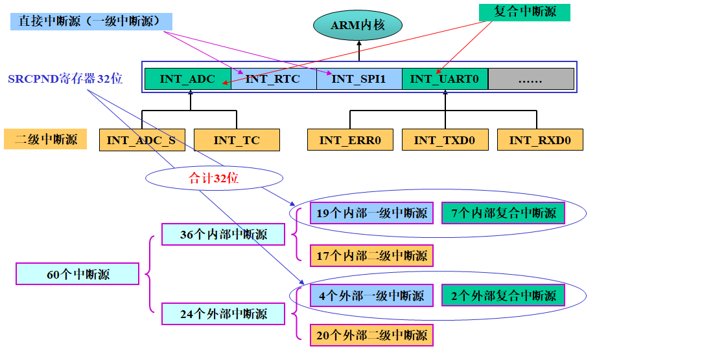
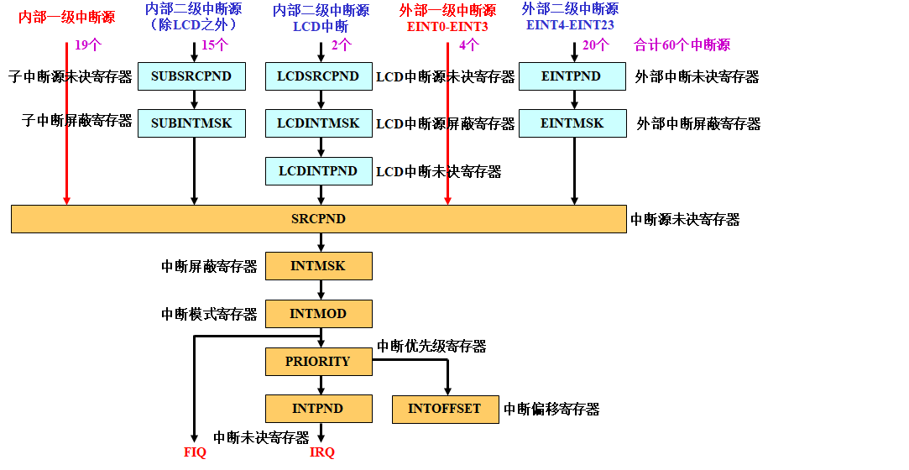
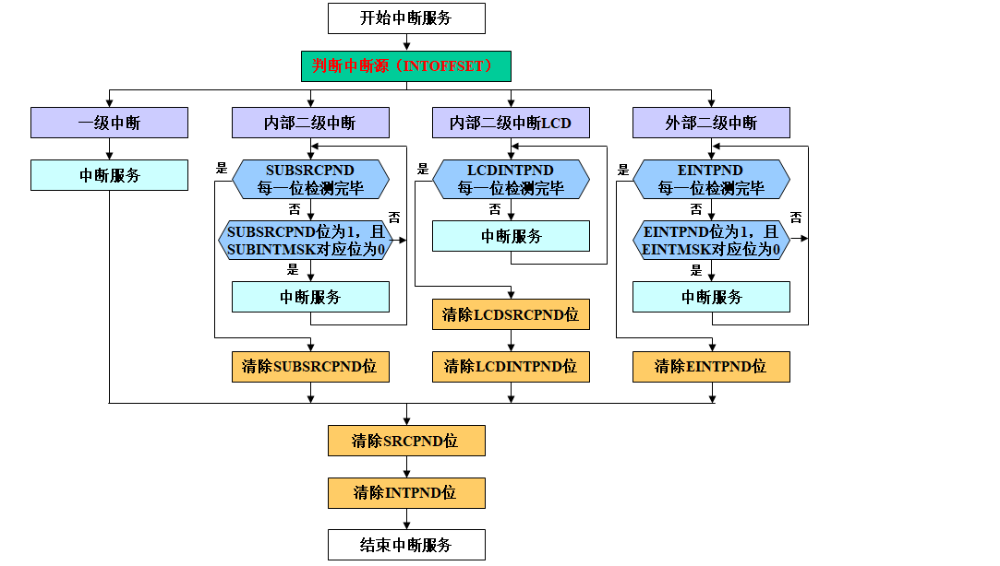
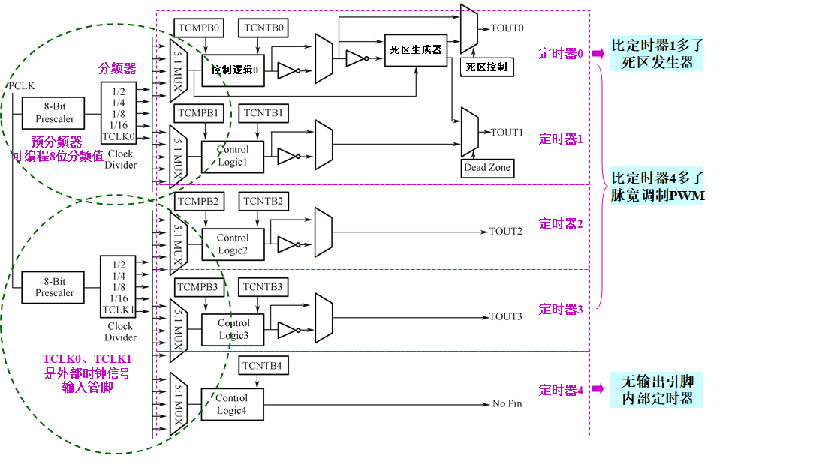
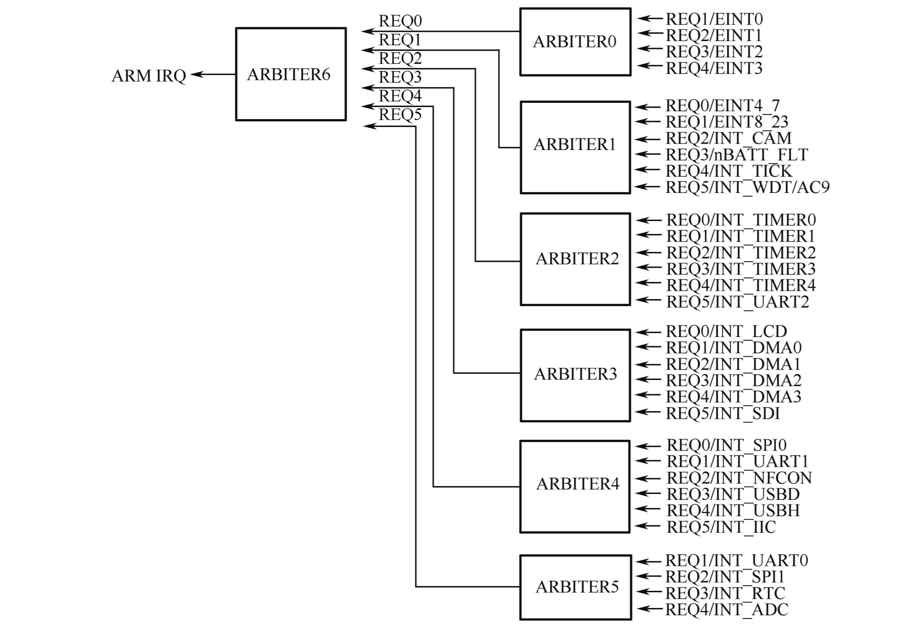

### 第5章 嵌入式内部可编程模块

#### 复习概要

##### 57. `S3C2440`.
`S3C2440` 是三星公司的 $16/32$ 位精简指令集(**RISC**) 微处理器,为面向手持设备和普通应用提供了低功耗和高性能的小型芯片微控制器的解决方案.
`S3C2440` 基于 `ARM920T` 核心.

##### 58. `ARM920T`.
`ARM920T` 实现了 **MMU**, **AMBA 总线**和**哈佛结构**高速缓冲体系结构.

##### 59. `S3C2440` 集成的片上功能.
?

##### 60. `S3C2440` 外部存储空间特点.
外部存储空间 `\rm1GB.`
存储块(**Bank**): $\rm8*128MB.$
引脚 `nGCS7~0` 是**通用片选信号**,用于选择 `Bank7~0`.
存储模式: 小端模式/大端模式(通过软件选择).
数据位宽: `Bank0` $16/32$ 位,其它 `Bank` $8/16/32$ 位.
`Bank0~5` 可接 **ROM**, **SRAM**.
`Bank6~7` 可接 **ROM**, **SRAM**, **SDRAM**.
`Bank0~6` 的起始地址是固定的, `BANK7` 的起始地址是可调整的.
`Bank6~7` 的寻址范围可通过编程调整.

##### 61. 内存类型
**ROM**: Read-Only Memory, 只读存储器,包括 **EEPROM** 和 **Flash**.
**SRAM**: Static RAM, 静态随机存储器.
**SDRAM**: Synchronous Dynamic Random Access Memory, 同步动态随机存储器. 同步是指存储器工作需要同步时钟,第四代 **SDRAM** 是 **DDR3 SDRAM**.
**SIMM**: Single In-line Memory Module, 单列内存模块. 内存模块就是内存条,单列是指模块电路板与主板插槽的接口只有一列引脚.
**DIMM**: Double In-line Memory Module, 双列内存模块,常见的模块类型,双列是指模块电路板与主板插槽的接口有两列引脚.
**RIMM**: Registered DIMM, 带寄存器的双线内存模块.
**SO-DIMM**: Small Outline DIMM, 小外形双列内存模块,笔记本常用.
**Flash**: Flash EEPROM Memory, 闪存,本质上属于 **EEPROM** 类型,分为 **NOR flash** 和 **NAND flash** 二种.
**NOR Flash**: 操作以 `字` 为基本单位,带有 **SRAM** 接口,容量较小,价格高,可靠性高.程序可在芯片内执行(**XIP**, eXecute In Place), 故可以直接用做 **boot**.
**NAND Flash**: 操作以 `块` 为基本单位,使用 I/O 口串行存取数据,容量较大,改写速度快,存在坏区,使用错误更正算法 **ECC** 确保数据完整性,不能 **XIP**, 因此不能直接作为 **boot**.

##### 62. NOR Flash 和 NAND Flash 的区别.
**NOR Flash**: 操作以 `字` 为基本单位,带有 **SRAM** 接口,容量较小,价格高,可靠性高.程序可在芯片内执行(**XIP**, eXecute In Place), 故可以直接用做 **boot**.
**NAND Flash**: 操作以 `块` 为基本单位,使用 I/O 口串行存取数据,容量较大,改写速度快,存在坏区,使用错误更正算法 **ECC** 确保数据完整性,不能 **XIP**, 因此不能直接作为 **boot**.

##### 63. NAND Flash 有 $2$ 种工作模式.
**自动启动模式**: 重启时自动将 **NAND Flash** 上的启动代码加载到 $\rm4KB$ 的 **stepping stone** (跳转缓冲器)上,然后代码在 **stepping stone** 上执行.
**NAND Flash 模式**(**软件模式**): 作为一般性存储器,可读可写.

##### 64. NAND Flash 启动.
1. `S3C2440` 能够把 **BootLoader** 烧到 **NAND Flash** 上启动,是因为在 `S3C2440` 里有一个内置的 $\rm4K$ **SRAM** 缓冲区,叫做 **stepping stone** (跳转缓冲器).
2. **ARM** 开发板上电后,首先自动判断是否是 **autoboot** 模式,如果是 **autoboot** 模式,内置的 **NAND Flash** 控制器自动将 **NAND Flash** 的最前面的 $\rm4K$ 区域(这 $\rm4K$ 区域存放着 **BootLoader** 的最前面 $\rm4K$ 代码)拷贝到 **stepping stone** 里面.
3. 拷贝完前 $\rm4K$ 代码后,  **NAND Flash** 控制器自动将  **stepping stone** 映射到 **ARM** 地址空间 `0x00000000` 开始的前 $\rm4K$ 区域.
4. 映射完成后, **NAND Flash** 控制器将 `PC` 指针直接指向 **ARM** 地址空间的 `0x00000000` 位置,开始执行  **stepping stone** 上的代码.
5. 这样,系统启动后,把 **NAND Flash** 上的起始  $\rm4K$ 的内容拷贝到 **SRAM** 里执行,就实现了从 **NAND Flash** 启动.
6. 如果 **BootLoader** 小于 $\rm4K,$ 在 **SRAM** 里就能 **boot**; 大于 $\rm4K,$ 在 **SRAM** 里做基本初始化后,再把剩余部分拷贝到 **SDRAM** 里(> `0x30000000`).

##### 65. `K9F1208U0C` 芯片主要特点.
容量: $\rm64MB.$
工作电压: $2.7\sim3.6V.$
内部存储结构: $\rm528B*32页*4096块.$
页大小: $512B+16B.$
块大小: $16K+512B.$
可实现擦除,读/写操作.
内部有命令寄存器.

##### 66. `K9F1208U0C` NAND Flash 阵列组织.
**Pape**: $\rm512B+16B$ (数据+校验)组成. 每页被分成 **1st half** 和 **2nd half**.
**Block**: 由 $32$ 个页组成, $\rm32*(512B+16B)=16KB+512B.$
`K9F1208U0C`: 有 $4096$ 个块, $\rm4096*32*(512B+16B)=66MB.$
每页最后 $\rm16B$ 用于存贮检验码,实际容量 $\rm64MB.$

##### 67. `K9F1208U0C` 初始化程序分析.

##### 68. `S3C2440` 的 GPIO. (P184.2)
**GPIO**, General Purpose I/O ports, 通用输入输出端口.
$130$ 个 **GPIO** 引脚分布在 $9$ 个 **GPIO** 端口:
|端口|引脚数|主要用于|Others|
|-|-|-|-|
**GPA**|$23$|输出,地址总线, **Bank** 选择, **NAND Flash** 控制|无内部上拉电阻
**GPB**|$11$|输入输出, **DMA** 请求,定时器输出
**GPC**|$16$|输入输出, **LCD** 接口
**GPD**|$16$|输入输出, **LCD** 接口, **SPI** 接口
**GPE**|$16$|输入输出, **SPI** 接口, **SD** 卡接口, **IIC** 接口, **IIS** 接口, **AC97** 控制器接口
**GPF**|$8$ |输入输出,中断请求输入口
**GPG**|$16$|输入输出,中断请求输入口, **UART** 接口, **SPI** 接口
**GPH**|$11$|输入输出,时钟输出, **UART** 接口
**GPJ**|$13$|输入输出,摄像头接口
每个 **GPIO** 端口均是多功能的.

##### 70. `S3C2440` 每个端口对应的 $3$ 个寄存器.
控制寄存器 `GPCCON`, 数据寄存器 `GPCDAT`, 上拉电阻寄存器 `GPCUP`.
其中 **GPA** 无上拉电阻.

##### 71. 端口初始化程序分析与设计.端口编程综合应用,参考例 5-2.
(PPT 5.2.75).

##### 72. `S3C2440` 有 $60$ 个中断源. (P184.3)
这些**中断源**由内部的外围 I/O 端口或部件如 **DMA** 控制器, **UART**, **IIC** 等提供.

##### 73. IRQ 和 FIQ 的区别.
**IRQ**, Interrupt ReQuest, 普通中断请求.
**FIQ**, Fast Interrupt reQuest, 快速中断请求.
区别:
1. 对于 **FIQ**, 必须尽快处理事件并离开这个模式.
2. **IRQ** 可以被 **FIQ** 中断,但 **IRQ** 不能中断 **FIQ**.
3. 为使 **FIQ** 更快, **FIQ** 模式具有更多的私有寄存器.

##### 74. 中断源类型.
内部中断源 $36$ 个,外部中断源 $24$ 个.

##### 75. `SRCPND` 中的中断源类型.
**直接中断源**: 来源单一的中断源,如 **INT_RTC** (**RTC** 闹钟中断), **EINT0** (外部中断 `0`) 等. 一旦中断请求被响应,可以直接定位中断来源.
**复合中断源**: 由多个中断源复合在一起的中断源,实际上是一个由多个中断源的中断请求以 `或` 逻辑复合在一起的中断请求标志. 由于该标志由多个中断请求复合而成,所以一旦中断请求被响应,需要通过其他方法定位中断来源. 如 **INT_UART0** (串口 `0` 中断)等.

##### 76. 一二级中断源.
**一级中断源**: `SRCPND` 中的直接中断源, $23=19+4$ 个(**内部中断源**+**外部中断源**).
**二级中断源**: `SRCPND` 中的复合中断源涉及的中断源, $37=17+20$ 个(**内部中断源**+**外部中断源**).

##### 77. 中断源类型分类.


##### 78. 中断机制.


##### 79. 中断处理流程.


##### 80. 中断优先级结构.
优先级总规则: 对于每个**仲裁模块**, `REQ0` `REQ5` 的优先级不变,并且 `REQ0` 最高, `REQ5` 最低.
**固定优先级**: `ARB_MODE=0`, 设为**固定优先级**.
**循环优先级**: `ARB_MODE=1`, 设为**循环优先级**.
优先级一旦设定将不再改变.

##### 81. 中断控制寄存器注意事项.
`SRCPND` **中断源未决寄存器**: `1` 表示相应的中断源产生了中断请求, `0` 表示相应的中断源没有产生中断请求. `SRCPND` 在同一时刻可以有多个位同时被置 `1`.
`INTMSK` **中断屏蔽寄存器**: 即使 `SRCPND` 某位已经置 `1`, 但是如果此时 `INTMSK` 的对应位是 `1` (屏蔽),则 **ARM** 也不会响应中断.
`INTPND` **中断未决寄存器**: 在同一时刻只能有 $1$ 个位被置 `1`, 表示 **ARM** 即将或已经在对该位相应的中断进行处理.
**ARM** 响应中断的条件:
1. 允许中断: `CPSR` 中 `I=0` 或 `F=0`.
2. 有中断请求: `SRCPND` 的对应位是 `1` (对子中断源, `SUBSRCPND` 对应位也必须是1).
3. 中断请求未被屏蔽: `INTMSK` 的对应位是 `0`.
4. 优先级最高: `INTPND` 的对应位是 `1`.

##### 82. 中断初始化程序分析与设计.

##### 83. `S3C2440` 的 DMA 系统支持 $4$ 个独立通道的控制器.

##### 84. DMA 请求方式与请求源.
**DMA 请求方式**:
硬件请求: `H/W` 请求模式,由选择的 **DMA** 请求源触发 **DMA** 操作.
软件请求: `S/W` 请求模式,通过软件设置请求 **DMA** 操作.
**DMA请求源**: 在 `H/W` 请求模式(硬件请求)有效,每个 **DMA** 通道有 $7$ 个 **DMA** 请求源,可以选择其中的一个.
说明: 虽然每个 **DMA** 通道有 $7$ 个 **DMA** 请求源,但各不相同.

##### 85. `S3C2440` DMA 的 $4$ 种传输方向.
$\rm(AHB,APB)^2.$

##### 86. `S3C2440` DMA 采用三态 FSM.
状态1: 等待 **DMA** 请求(初始状态). 一旦有请求,则进入**状态2**. 初始状态下, **DMA ACK信号** (**DMA** 应答信号)和 **INT REQ信号** (中断请求信号)都为 `0`.
状态2: 计数器加载. 在此状态下,计数器 (`CURR_TC`) 从 **DCON** 控制寄存器的 `[19:0]` 位加载计数初值.
状态3: 数据传输. 在此状态下,进行 **DMA** 基本操作. 从源地址读取数据并写入目的地址.

##### 87. DMA 计数器.
$20$ 位,**减1** 型计数器.

##### 88. DMA 的 $2$ 种工作模式.
**单服务模式**: 单数据传送,一次 **DMA** 请求完成一个数据单元的 **DMA** 传送.
**全服务模式**: 连续数据传送,一次 **DMA** 请求完成一批数据单元的 **DMA** 传送.

##### 89. DMA 传输数据单元.
一次 **DMA** 操作传送的数据宽度,包括 $3$ 种: `字节` `半字` `字`.

##### 90. DMA 的 $2$ 种传输模式.
**请求模式**, **握手模式**.

##### 91. DMA 的 $2$ 种基本传输模式.
单次传输方式: 一个基本的 **DMA** 传输操作完成一次读和一次写.
突发传输方式: 一个基本的 **DMA** 传输操作完成四次连续读和四次连续写.

##### 92. `S3C2440` 定时部件.
**看门狗定时器**, **RTC 实时时钟**, **Timer 定时器**.

##### 93. 看门狗定时器.
Watchdog Timer, $16$ 位定时器.
功能: 定时时间到,可以产生定时中断,也可以产生内部复位信号.
应用: 可以作为普通定时器使用; 当系统出现故障时(比如因为噪音/外部干扰/内部错误导致程序跑飞,系统不能正常运行),可以用产生的复位信号来恢复控制器的操作.
专用寄存器: $3$ 个.
`WTCON`: 看门狗定时器**控制**寄存器
`WTDAT`: 看门狗定时器**数据**寄存器
`WTCNT`: 看门狗定时器**计数**寄存器

##### 94. 看门狗定时器初始化程序分析与设计. 比如: 根据控制字格式,解释语句 `rWTCON|=((1<<5)|(1<<0))` 的作用.
(PPT 5.3.8).

##### 95. `S3C2440` 芯片 RTC 特点.
时间: `年` `月` `日` `时` `分` `秒` `星期`.
报警功能: 报警中断或从掉电模式唤醒.
支持毫秒级节拍时间中断.
数据以**压缩BCD码**形式表示.
可以用 `LDRB` / `STRB` 命令进行读/写操作.
外部晶振频率: $\rm32.768KHz.$
解决了 $2000$ 年问题.
独立的电源引脚 `RTCVDD`.

##### 96. RTC 初始化程序分析与设计.

##### 97. `S3C2440` Timer 定时器特点.
**Timer 定时器**提供定时,脉宽调制 (**PWM**) 等功能,应用比较灵活.
1. $5$ 个 $16$ 位定时器,每个定时器有 $1$ 个 $5$ 选 $1$ 时钟多路开关.
2. $2$ 个可编程 $8$ 位预分频器.
3. $2$ 个 $4$ 路分频器.
4. 脉宽调制 (**PWM**) 波形信号输出.
5. **PWM** 定时器双缓冲机制 (**TCNTBn** 和 **TCMPBn** 结构).
6. 单脉冲模式(产生单脉冲波形),自动加载模式(产生连续脉冲波形).
7. 死区发生器(产生延时波形信号输出).
8. 达到定时器时间,产生中断请求信号.
9. 达到定时器时间,产生DMA请求信号.

##### 98. MPLL 产生的 $3$ 个时钟.
**FCLK**: 用于 **ARM** 核.
**HCLK**: 用于 **AHB** 总线设备.
**PCLK**: 用于 **APB** 总线设备.

##### 99. Timer 部件功能结构描述.


##### 100. PWM 原理.
Pulse Width Modulation, 脉宽调制,通过对周期性序列脉冲的脉冲宽度进行调制,等效地获得所需要的波形. 广泛应用于测量,通信,功率控制与变换等许多领域.

##### 101. `S3C2440` 定时器的双缓冲结构.
定时器**计数**缓冲寄存器 `TCNTBn` $5$ 个;
定时器**比较**缓冲寄存器 `TCMPBn` $4$ 个.

##### 102. Timer 定时器死区作用.
关闭一个开关设备和开启另一个开关设备之间插入的时间间隔. 这个时间间隔可以防止两个设备同时被启动.

##### 103. Timer 定时器初始化一般流程.
1. 选择一个定时器 (0,1,2,3,4);
2. 设置预分频值 (**TCFG0**);
3. 设置分频值 (TCFG1);
4. 设置计数初值 (TCNTBn) 和比较初值 (TCMPBn);
5. 设置手动更新,自动加载 (TCON);
6. 清除手动更新 (TCON);
7. (如果需要定时器中断,则完成相应中断配置);
8. 启动(开始)定时器工作.

##### 104. Timer 定时器初始化程序分析与设计.综合应用.

##### 105. `S3C2440` UART 特点. (P184.6)
1. 三个独立通道: `UART0` `UART1` `UART2`.
2. 工作方式: 中断模式, **DMA** 模式,查询模式.
3. 每帧: 数据位可选择 $5\sim8$ 位数据宽度,停止位可选择 $1/2$ 位,可选择奇偶校验.
4. 每个 **UART** 通道有 $1$ 个 $64$ 字节发送 **FIFO** 和 $1$ 个 $64$ 字节接收 **FIFO**.
5. 发送/接收数据缓冲方式: 单寄存器方式, **FIFO** 方式.
6. **自动流控制**(**AFC**): `UART0` `UART1` 支持 **AFC**.
7. 自带内部波特率发生器.
8. 可选择 $3$ 种时钟源: `PCLK`, `FCLK/n`, `UEXTCLK` (外部时钟).
9. 可支持最大波特率为 $\rm115.2Kbps$ (如果采用 `UEXTCLK` 外部时钟,可以在更高的速度下工作).
10. 支持红外收/发模式.
11. 支持**回送模式** (**Loopback Mode**).
12. `UART2` 没有 `nRTS` `nCTS` 引脚.

##### 106. UART 错误状态描述.
溢出错误: 新的数据已经覆盖了旧的数据,因为旧的数据没有及时被读入.
奇偶校验错误: 接收器检测到了意料之外的奇偶校验结果.
帧错误: 接收到的数据没有有效的停止位.
终止条件: `RxDn` 的输入被保持为 `0` 状态的时间超过了一个帧传输的时间 (`RxDn` 上出现大于一帧的 `0`).
接收超时: 接收器在 $3$ 个字长时间内都没有接收到任何数据,并且在 **FIFO** 模式下接收 **FIFO** 不为空,就会发生接收超时条件.

##### 107. UART AFC 原理.
Auto Flow Control, 自动流控制. 自动流控制方式在 **UART** 连接 **UART** 时使用,用 `nRTS` 和 `nCTS` 信号进行自动流控制.
发送: 当 `nCTS` 信号有效时(意味着对方的 **UART** 准备好接收数据),允许 `A` 口 `TxD` 发送自己 **FIFO** 中的数据.
接收: 当 `nRTS` 信号有效时(指示接收 **FIFO** 准备好接收数据),允许 `A` 口 `TxD` 发送数据. 当接收 **FIFO** 有多于 $32$ 个字节的空闲空间时,激活 `nRTS` 信号.

##### 108. UART 红外模式含义.
红外发送模式: 当传送的数据位为 `0` 时,其传送脉冲的宽度是常规 **UART** 数据位宽度的 $\displaystyle\frac3{16}.$
红外接收模式: 接收器必须进行周期性的检测,当检测到一个宽度为常规 **UART** 数据位宽度 $\displaystyle\frac3{16}$ 的脉冲时,判断为数据 `0` 否则判断为数据 `1`.

##### 109. UART FIFO 触发条件含义.
**UART** **FIFO** 状态寄存器 `UFSTATn` 共有 $3$ 个: `UFSTAT0` `UFSTAT1` `UFSTAT2`. 作用: 提供 **FIFO** 发送/接收/计数器的状态.

##### 110. UART 初始化流程.
|序号|流程步聚|相关寄存器|描述|
|-|-|-|-|
1|初始化引脚|`GPH0-GPH8,GPG9,GPG10`|初始化引脚为 **UART** 多功能引脚
2|选择时钟源|`UCONn[15:12],UCONn[11:10]`|选择一个 **UART** 传送的时钟源, `PCLK` `FCLK/n` `UEXTCLK` 三选一
3|配置波特率|`UBRDIVn[15:0]`|配置 **UART** 的波特率除数值
4|配置帧格式|`ULCONn[7:0]`|配置数据位,停止位,校验方式
5|配置自动流控制方式|`UMCONn[4:0]`|配置 **UART** 的自动流控制方式
6|配置收发 **FIFO**|`UCONn[9:7],UFCONn[7:0]`|配置 **UART** 的 **FIFO** 参数及 **FIFO** 的触发条件
7|配置收发模式|`UCONn[3:0]`|配置 **UART** 收发模式 (**DMA**/中断/轮询)

##### 111. UART 初始化程序分析与设计.
(PPT 5.3.84).

##### 112. A/D 转换的基本过程.
**ADC**, Analog to Digital Converter, **A/D转换器**, 是**模拟信号**和 **CPU** 之间的接口,作用是将**模拟信号**转换为**数字信号**,以供计算机进行处理,存储,控制和显示.
实现 **A/D (模/数)转换**的方法很多,常用的方法有**计数法**,**双积分法**和**逐次逼近法**.

##### 116. ADC 的 $2$ 种启动方式.
命令启动,读数据启动.

##### 117. 完成一次 ADC 转换.
产生 $10$ 位二进制数,这个过程需要占用 $5$ 个 ADC 时钟周期.
$$\rm ADC转换时间=5*ADC时钟周期=5/(PCLK/(预分频值+1)).$$

#### 教材复习题及课外练习题

教材 P184: 7,10,11

##### 274. `S3C2440` 芯片外部可寻址的存储空间是多少? (P184.1)
外部存储空间 $\rm1GB,$ 存储块 (**Bank**) $8$ 个.

##### 0.4 `S3C2440` 芯片有几个通道 DMA, 共有多少个寄存器? (P184.4)
有 $4$ 个通道 **DMA**, $36$ 个寄存器,其中 $6$ 个用于控制 **DMA** 传输, $3$ 个用于监视 **DMA** 的控制器的状态.

##### 276. 看门狗定时器原理是什么? (P184.5)
看门狗定时器是 $16$ 位时间间隔定时器,定时溢出来请求中断服务,每 $128$ 个 `PCLK` 时钟周期产生一个复位信号.

##### 277. 触摸屏接口模式分哪几类? (P184.8)

##### 278. 编程序实现流水灯. (P184.9)
```c
#define rGPFCON (*(volatile unsigned*)0x56000050)   //定义GPFCON地址
#define rGPFDAT (*(volatile unsigned*)0x56000054)   //定义GPFDAT地址
#define rGPFUP (*(volatile unsigned*)0x56000058)    //定义GPFUP地址
void Delay(unsigned int);                           //无返回结果,LED点亮的延时程序
int Ledlamp(){                                      //流水灯控制程序
    unsigned char ledtab[]={0xF7,0xEF,0xDF,0xBF};   //流水灯点亮数据
    int i;
    rGPFUP&=0x87;                                   //配置GPF6-GPF3使用上拉电阻
    rGPFCON&=0xC03F;
    rGPFCON|=0x1540;                                //配置GPF6-GPF3引脚为输出口
    while(1){
        for(i=0;i<4;i++){                           //循环点亮4个发光二极管
            rGPFDAT=ledtab[i];                      //点亮发光二极管LEDi
            Delay(70);                              //延时
        }
    }
    return 0;
}
void Delay(unsigned int x){                         //延时程序
    unsigned int i,j,k;
    for(i=0;i<=x;i++)
        for(j=0;j<=0xff;j++)
            for(k=0;k<=0xff;k++);
}
```
```nasm
AREA |DATA|, CODE, READONLY ;主程序
ENTRY
LDR R13, =0x1000            ;设置堆栈地址指针,子程序调用时保护现场
BL  Ledlamp                 ;调用C语言的流水灯函数Ledlamp
IMPORT Ledlamp              ;声明标号Ledlamp是在外部(其他源文件中)定义的
END
```

##### 279. 编程序实现三角波/方波 (P184.11)

##### 280. 向量 IRQ 和非向量 IRQ 有什么不同?
向量 **IRQ** 支持 $16$ 个向量 **IRQ** 中断, $16$ 个优先级,能为每个中断源设置服务程序地址;非向量 **IRQ** 支持一个非向量 **IRQ** 中断,所有中断都共用一个相同的服务程序入口地址.

##### 283. 说明 `S3C2440` 优先级仲裁功能,并描述优先级仲裁过程. 
`SRCPND` (中断源未决寄存器) 中的 $32$ 个中断请求通过 $7$ 个仲裁器 (优先级判别逻辑)的选择,最终生成一个优先级最高的中断源,设置在 `INTPND` (中断未决寄存器) 中.
仲裁器功能: 确定中断源的优先级, $6$ 个一级仲裁器, $1$ 个二级仲裁器.
优先级仲裁过程:
先一级: 每个一级仲裁器对自己的分组进行优先级判别,选择一个优先级最高的中断,送给二级仲裁器. $6$ 个一级仲裁器形成 $6$ 个中断源.
后二级: 二级仲裁器在一级仲裁器输出的 $6$ 个中断源中选择一个优先级最高的中断源进行触发.
仲裁器控制: 每个仲裁器有 $2$ 个控制信号, `ARB_MODE` `ARB_SEL`.
`ARB_MODE`: 仲裁模式, $1$ 位. `0` 固定优先级, `1` 循环优先级.
优先级总规则: 对于每个仲裁模块, `REQ0` `REQ5` 的优先级不变,并且 `REQ0`最高, `REQ5` 最低.


##### 284. 简要说明 ARM 的异常的响应和返回的过程.
**异常的进入**:
1. 将下一条指令的地址存入相应连接寄存器 `LR`, 以便程序在处理异常返回时能从正确的位置重新开始执行.
2. 将 `CPSR` 复制到相应的 `SPSR` 中.
3. 根据异常类型,强制设置 `CPSR` 的运行模式位.
4. 强制 `PC` 从相关的异常向量地址取下一条指令执行,从而跳转到相应的异常处理程序. 也可以设置中断禁止位来阻止其他无法处理的异常嵌套.
**异常的返回**:
1. 将链接寄存器 `LR` 的值减去相应的偏移量后送到 `PC` 中.
2. 将 `SPSR` 复制回 `CPSR` 中.
3. 如果进入时设置了中断禁止位,那么清除该标志.

##### 286. Flash 存储器主要有 `NAND` 和 `NOR` 两大类.

##### 287. `S3C2440A` 内部有 $3$ 个时钟,分别是 ARM 的内核时钟 `FCLK`, AHB 总线时钟 `HCLK`, I/O 接口的时钟 `PCLK`.

##### 288. Nand Flash 比 NOR Flash 成本 `低`, 可靠性 `差`.

##### 289. ARM 处理器采用 AMBA 总线架构,分别是先进系统总线 `ASB`, 先进高性能总线 `AHB`, 先进外围总线 `APB`.

##### 290. Flash 存储器应该接在 `AHB` 上.
A. ASB
**B. AHB**
C. APB
D. CAN

##### 291. 某公司生产的 NAND Flash 存储器的组织结构为 $\rm2048block*32page*2048byte,$ 则其容量是 `128MB`.
A. $\rm64MB$
**B. $\rm128MB$**
C. $\rm32MB$
D. $\rm256MB$

##### 292. `S3C2440A` 的电源管理有 $4$ 种模式: `正常` 模式, `慢速` 模式, `空闲` 模式, `睡眠` 模式.

##### 293. `S3C2440A` 共有 `130` 个 GPIO 口,可分为 `9` 组.

##### 294. `S3C2440A` 的 GPIO 口只能作为输出使用的是 `GPA`.

##### 295. 设 `S3C2440A` 处理器的 `PCLK` 的频率 $\rm f_{pclk}=40MHz,$ 经过 $1/100$ 预分频和 $1/4$ 分频后,送给定时器的计数时钟周期 $\rm f_{pclk}$ 的输出周期是 `10` $\mu s.$
A. 100
B. 1
**C. 10**
D. 0.1

##### 296. 使用 `S3C2440A` 处理器的定时器 timer1 来产生频率为 $\rm1KHz,$ 占空比为 $30\%$ 的方波. 已知定时器 timer1 的时钟的输出频率 $\rm f_{TCLK}=1MHz,$ 则定时器 timer1 的计数初值寄存器 `TCNTB1` 的数值应设定为 `100`, 比较寄存器 `TCMPB1` 数值应设定为 `30`.

##### 297. 假设某嵌入式系统底层通讯采用 DMA 数据传输,如图所示是未完成的 DMA 数据传输工作流程图,请完成该图.

##### 300. `S3C2440` 的中断源未决寄存器和中断未决寄存器的区别和作用有哪些?
中断源未决寄存器的作用: 保存中断源申请中断的状态.
中断未决寄存器的作用: 保存经过中断优先级判别后最高优先级的申请中断状态.

##### 315. 在嵌入式系统的存储结构中,存取速度最快的是 `寄存器组`.

##### 316. 电路如下图所示, `GPF2` `GPF3` 是 `S3C2440` 两个引脚,编程可能涉及到寄存器 `rGPFDAT` `rGPFUP` `rGPFCON`, 阐述电路工作原理? 编程实现如下功能: 初始条件 LED 不亮,按键 KEY 按下奇数次 LED 点亮,按键 KEY 按下偶数次 LED 不亮.
`GPF2` 送低电平, **LED** 亮. **Key** 按下时, `GPF3` 为低电平.
初始化; 判断按键; **LED** 控制; 其他.

##### 318. `S3C2440` 自带一个 `8 路 10 位` A/D 转换器.
**A. $8$ 路 $10$ 位**
B. $10$ 路 $8$ 位
C. $8$ 路 $12$ 位
D. $12$ 路 $8$ 位

##### 319. `S3C2440` 在 UART 连接 UART 时支持用 `nRTS` `nCTS` 信号进行自动流控制.
A. `RxD` `TxDB`
**B. `nRTS` `nCTS`**
C. `nRTS` `RxD`
D. `nCTS` `TxD`

##### 320. `S3C2440` 具有 `60` 个中断源.

##### 321. IRQ 中断处理程序可以执行指令 `SUBS PC,R14_irq,#4` 从 IRQ 中断返回,说明指令中减 $4$ 的原因.
三级流水线.

##### 322. UART 操作出现的帧错误是指 `接收到的数据没有有效的停止位`.
**A. 接收到的数据没有有效的停止位**
B. 新的数据已经覆盖了旧的数据
C. 接收器检测到了意料之外的奇偶校验结果
D. `RxDn` 的输入被保持为 `0` 状态的时间超过了一个帧传输的时间
